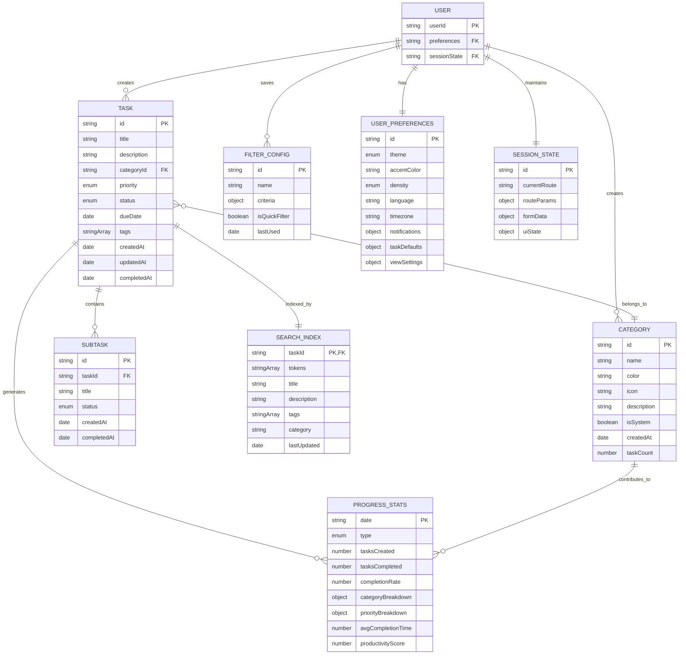

# Entity Relationships - TaskMaster v1.0

## Entity Relationship Diagram

## Data Ownership Map

| Entity | Owning Service | Storage | Read Access | Write Access | Lifecycle |
|--------|----------------|---------|-------------|---------------|-----------|
| **Tasks** | Task Manager | IndexedDB | All services | Task Manager only | Create → Active → Complete → Archive |
| **Categories** | Task Manager | IndexedDB | All services | Task Manager only | Create → Active → Archive |
| **Subtasks** | Task Manager | IndexedDB | All services | Task Manager only | Tied to parent task |
| **Search Index** | Search Engine | IndexedDB | Search Engine | Search Engine only | Auto-maintained |
| **Filter Configs** | Filter Engine | localStorage | Filter Engine | Filter Engine only | User-managed |
| **Progress Stats** | Progress Tracker | IndexedDB | Progress Tracker, UI | Progress Tracker only | Auto-calculated |
| **User Preferences** | Settings Manager | localStorage | All services | Settings Manager only | User-controlled |
| **Session State** | UI Components | Memory/sessionStorage | UI Components | UI Components only | Session-scoped |

## Entity Relationships and Dependencies

### Core Data Entities

| Relationship | Cardinality | Referential Integrity | Cascade Behavior | Business Rules |
|-------------|-------------|----------------------|------------------|----------------|
| Tasks → Categories | Many:1 | Tasks must reference valid category IDs | Category deletion requires task reassignment | "Uncategorized" fallback for orphaned tasks |
| Tasks → Subtasks | 1:Many | Subtasks have no independent existence | Subtasks deleted when parent task is deleted | Subtask completion affects parent task statistics |
| Tasks → Search Index | 1:1 | Index automatically updated on task changes | Index maintained separately from task storage | Optimized for full-text search operations |

### Derived Data Relationships

| Source → Target | Aggregation Type | Recalculation | Historical Data | Dependencies |
|----------------|------------------|---------------|-----------------|--------------|
| Tasks → Progress Stats | Real-time | Stats updated when tasks are created, completed, or modified | Statistics maintain historical snapshots | Task categorization affects category-based breakdowns |
| Categories → Progress Stats | Batch | Category task count derived from associated tasks | Category-specific completion rates and trends | Each category contributes to aggregated statistics |

### Configuration and State Relationships

| Config Entity → Target | Global Impact | Application | Dependencies |
|------------------------|---------------|-------------|--------------|
| User Preferences → All Services | Preferences affect behavior across all services | Visual preferences applied to all UI components, task creation defaults | Language and timezone preferences affect data presentation |
| Filter Configs → Tasks | Filter configurations define task subset views | Saved filter combinations for repeated use | Filters reference task attributes without direct links |
| Session State → UI Components | Individual components maintain their own session state | Router state affects component rendering, form data during task creation/editing | Modal states, expanded sections, selections |

## Access Control and Boundaries

### Service Ownership Boundaries

| Service | Full Control | Read Access | Write Authority | Validation |
|---------|--------------|-------------|-----------------|------------|
| Task Manager | Tasks, categories, subtasks | All task-related data for CRUD operations | Only service that can modify core task data | Enforces business rules and data integrity |
| Search Engine | Independent search index | Reads task data for indexing only | Maintains search index updates | Optimized for search query execution |
| Filter Engine | Saved filter configurations | Task data for display filtering | Read-only access to task data | Stores and applies user-defined filter combinations |
| Progress Tracker | Calculated statistics | Tasks and categories for calculations | Full control over calculated statistics | Maintains time-based statistics and historical aggregation |
| Settings Manager | User customization settings | Global configuration access | Settings affect all other services | Ensures settings survive browser sessions |

### Data Flow Patterns

| Pattern Type | Step | Description |
|-------------|------|-------------|
| Write Operations | 1. | Task Manager receives user input for task operations |
| | 2. | Validation of data integrity and business rules |
| | 3. | Storage update - Updates IndexedDB with validated data |
| | 4. | Event emission - Notifies dependent services of changes |
| | 5. | Index update - Search Engine updates search index |
| | 6. | Statistics recalculation - Progress Tracker updates metrics |
| Read Operations | 1. | Service requests specific data subset |
| | 2. | Access control - Verify service has read permissions |
| | 3. | Data retrieval from appropriate storage layer |
| | 4. | Transformation - Apply necessary data transformations |
| | 5. | Response - Return formatted data to requesting service |
| Cross-Service Communication | | Event-driven architecture - Services communicate through events |
| | | Loose coupling - Services depend on data contracts, not implementations |
| | | Async updates - Non-critical updates processed asynchronously |
| | | Error isolation - Service failures don't cascade to other services |

---

*This data ownership model ensures secure, consistent data management while maintaining clear service boundaries and supporting the MVP scale of TaskMaster v1.0.*