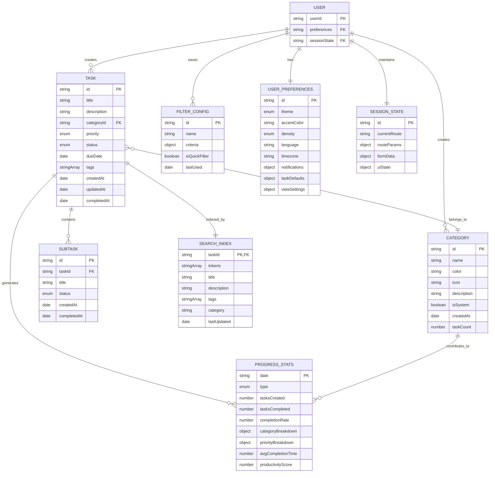

# Entity Relationships - TaskMaster v1.0

## Purpose
Define the data model with entity relationships, ownership boundaries, and access patterns for TaskMaster's client-side architecture.

## Entity Relationship Diagram

## Data Ownership Map

| Entity | Owning Service | Storage | Read Access | Write Access | Lifecycle |
|--------|----------------|---------|-------------|---------------|-----------|
| **Tasks** | Task Manager | IndexedDB | All services | Task Manager only | Create → Active → Complete → Archive |
| **Categories** | Task Manager | IndexedDB | All services | Task Manager only | Create → Active → Archive |
| **Subtasks** | Task Manager | IndexedDB | All services | Task Manager only | Tied to parent task |
| **Search Index** | Search Engine | IndexedDB | Search Engine | Search Engine only | Auto-maintained |
| **Filter Configs** | Filter Engine | localStorage | Filter Engine | Filter Engine only | User-managed |
| **Progress Stats** | Progress Tracker | IndexedDB | Progress Tracker, UI | Progress Tracker only | Auto-calculated |
| **User Preferences** | Settings Manager | localStorage | All services | Settings Manager only | User-controlled |
| **Session State** | UI Components | Memory/sessionStorage | UI Components | UI Components only | Session-scoped |

## Entity Relationships and Dependencies

### Core Data Entities

#### Tasks → Categories (Many-to-One)
- **Relationship**: Each task belongs to one category
- **Referential Integrity**: Tasks must reference valid category IDs
- **Cascade Behavior**: Category deletion requires task reassignment
- **Default Fallback**: "Uncategorized" for orphaned tasks

#### Tasks → Subtasks (One-to-Many)
- **Relationship**: Tasks can contain multiple subtasks
- **Ownership**: Subtasks have no independent existence
- **Lifecycle**: Subtasks deleted when parent task is deleted
- **Progress Impact**: Subtask completion affects parent task statistics

#### Tasks → Search Index (One-to-One)
- **Relationship**: Each task has corresponding search index entry
- **Synchronization**: Index automatically updated on task changes
- **Isolation**: Search index maintained separately from task storage
- **Performance**: Optimized for full-text search operations

### Derived Data Relationships

#### Tasks → Progress Stats (Many-to-Many)
- **Aggregation**: Multiple tasks contribute to daily/weekly/monthly statistics
- **Recalculation**: Stats updated when tasks are created, completed, or modified
- **Historical Data**: Statistics maintain historical snapshots
- **Category Impact**: Task categorization affects category-based breakdowns

#### Categories → Progress Stats (One-to-Many)
- **Category Metrics**: Each category contributes to aggregated statistics
- **Task Count**: Category task count derived from associated tasks
- **Performance Tracking**: Category-specific completion rates and trends

### Configuration and State Relationships

#### User Preferences → All Services (One-to-Many)
- **Global Impact**: Preferences affect behavior across all services
- **Theme Application**: Visual preferences applied to all UI components
- **Default Values**: Task creation uses preference-defined defaults
- **Localization**: Language and timezone preferences affect data presentation

#### Filter Configs → Tasks (Many-to-Many)
- **Query Application**: Filter configurations define task subset views
- **User Customization**: Saved filter combinations for repeated use
- **No Direct Dependency**: Filters reference task attributes without direct links

#### Session State → UI Components (One-to-Many)
- **Component State**: Individual components maintain their own session state
- **Navigation State**: Router state affects component rendering
- **Form State**: Temporary form data during task creation/editing
- **UI Persistence**: Modal states, expanded sections, selections

## Access Control and Boundaries

### Service Ownership Boundaries

#### Task Manager
- **Full Control**: Tasks, categories, subtasks
- **Read Access**: All task-related data for CRUD operations
- **Write Authority**: Only service that can modify core task data
- **Validation**: Enforces business rules and data integrity

#### Search Engine
- **Isolated Domain**: Maintains independent search index
- **Event-Driven Updates**: Responds to task change events
- **Read-Only Task Access**: Reads task data for indexing only
- **Performance Optimization**: Optimized for search query execution

#### Filter Engine
- **Configuration Management**: Manages saved filter configurations
- **Task Query Interface**: Applies filters to task data for display
- **No Task Modification**: Read-only access to task data
- **User Preferences**: Stores and applies user-defined filter combinations

#### Progress Tracker
- **Statistics Generation**: Calculates metrics from task data
- **Historical Aggregation**: Maintains time-based statistics
- **Read-Only Source Data**: Accesses tasks and categories for calculations
- **Derived Data Ownership**: Full control over calculated statistics

#### Settings Manager
- **User Preferences**: Manages all user customization settings
- **Global Configuration**: Settings affect all other services
- **Cross-Service Impact**: Preference changes propagate to dependent services
- **Persistence**: Ensures settings survive browser sessions

### Data Flow Patterns

#### Write Operations Flow
1. **Task Manager**: Receives user input for task operations
2. **Validation**: Validates data integrity and business rules
3. **Storage Update**: Updates IndexedDB with validated data
4. **Event Emission**: Notifies dependent services of changes
5. **Index Update**: Search Engine updates search index
6. **Statistics Recalculation**: Progress Tracker updates metrics

#### Read Operations Flow
1. **Service Request**: Service requests specific data subset
2. **Access Control**: Verify service has read permissions
3. **Data Retrieval**: Fetch data from appropriate storage layer
4. **Transformation**: Apply any necessary data transformations
5. **Response**: Return formatted data to requesting service

#### Cross-Service Communication
- **Event-Driven Architecture**: Services communicate through events
- **Loose Coupling**: Services depend on data contracts, not implementations
- **Async Updates**: Non-critical updates processed asynchronously
- **Error Isolation**: Service failures don't cascade to other services

---

*This data ownership model establishes clear entity relationships and service boundaries while maintaining the flexibility needed for TaskMaster v1.0's client-side architecture.*