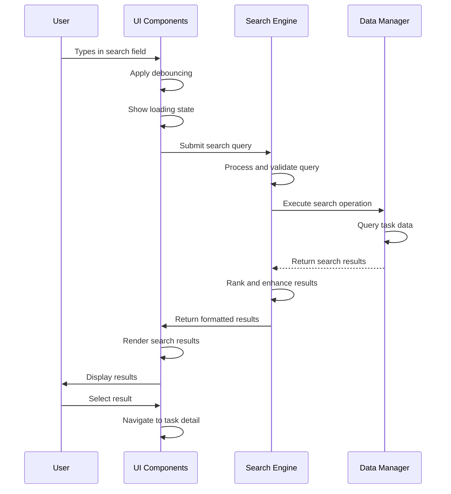

# System Flow: Real-Time Search - TaskMaster v1.0

## Trigger
User types in search input field with real-time search functionality.

## Sequence Diagram

## Step-by-Step Timeline

### 1. User Input Detection
**Trigger**: User types in search field  
**Component**: UI Components  
**Actions**:
- Capture input with debouncing
- Show loading indicator for queries >= 2 characters
- Clear previous results

**Success Response**: Search input validated

### 2. Query Processing
**Trigger**: Debounced input from UI  
**Component**: Search Engine  
**Actions**:
- Validate and normalize query
- Check result cache

**Success Response**: Query prepared  
**Failure Scenarios**: 
- Query too short → Skip search
- Invalid input → Sanitize and proceed

### 3. Search Execution
**Trigger**: Processed query  
**Component**: Search Engine + Data Manager  
**Actions**:
- Execute search against task index
- Apply relevance ranking
- Limit results for performance

**Success Response**: Ranked results retrieved  
**Failure Scenarios**:
- Index issues → Fallback to direct search
- Storage errors → Graceful error handling

### 4. Result Enhancement
**Trigger**: Raw search results  
**Component**: Search Engine + Data Manager  
**Actions**:
- Fetch complete task data
- Apply highlighting and context
- Prepare preview data

**Success Response**: Enhanced results ready

### 5. UI Result Display
**Trigger**: Enhanced results  
**Component**: UI Components  
**Actions**:
- Render results with highlighting
- Show count and navigation options
- Display empty results messaging

**Success Response**: Results visible to user

### 6. User Interaction
**Trigger**: User interacts with results  
**Component**: UI Components + Task Manager  
**Actions**:
- Handle selection and navigation
- Provide task preview
- Update interaction state

**Success Response**: User can navigate results

## Service Roles

### UI Components
- **Primary**: Input handling and result presentation
- **Secondary**: Loading states and feedback
- **Data Flow**: Captures input → Requests search → Displays results

### Search Engine  
- **Primary**: Query processing and ranking
- **Secondary**: Performance optimization and caching
- **Data Flow**: Processes queries → Coordinates with Data Manager → Returns results

### Data Manager
- **Primary**: Data retrieval and index management
- **Secondary**: Storage optimization
- **Data Flow**: Executes queries → Returns data → Supports enhancement

## Error Scenarios

### Search System Degradation
**Scenario**: Search performance degrades or unavailable  
**Response**:
- Fallback to basic browsing
- Show performance notifications
- Maintain core functionality

**Recovery**: Automatic recovery or manual intervention

### No Results Found
**Scenario**: Query returns no matching tasks  
**Response**:
- Display "no results" messaging
- Suggest alternative approaches
- Provide option to create task with search terms

**Recovery**: User refines search or creates content

### Storage Access Issues
**Scenario**: Unable to access task data  
**Response**:
- Display error with retry options
- Degrade to manual browsing
- Maintain application stability

**Recovery**: User retries or uses alternative navigation