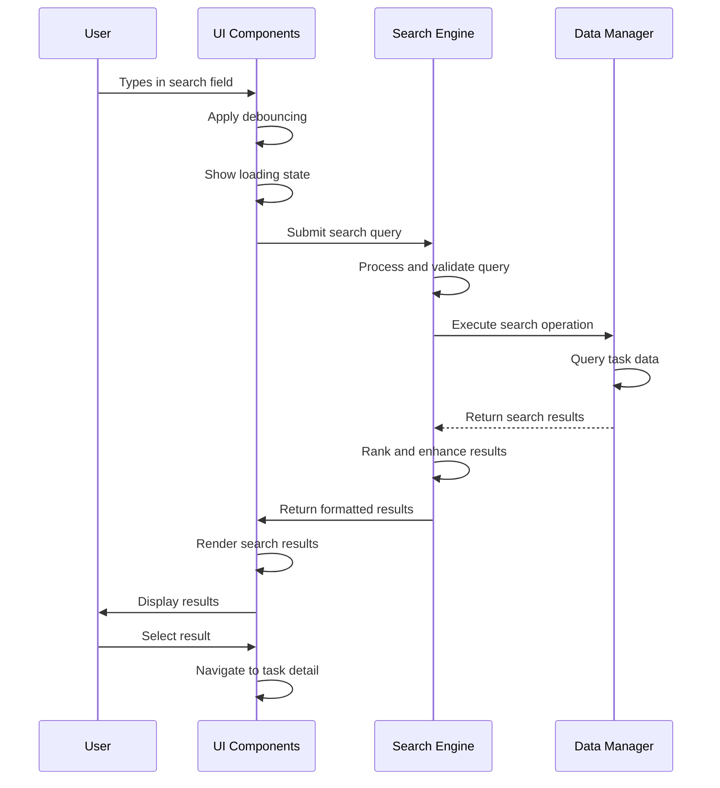

# System Flow: Real-Time Search - TaskMaster v1.0

## Trigger
User types in the search input field on the dashboard with real-time search functionality.

## Sequence Diagram

## Step-by-Step Timeline

### 1. User Input Detection
**Trigger**: User types in search input field  
**Component**: UI Components (Dashboard Search)  
**Actions**:
- Capture user input with debouncing
- Show loading indicator for queries >= 2 characters
- Clear previous search results

**Success Response**: Search input registered and validated

---

### 2. Query Processing
**Trigger**: Debounced search input from UI  
**Component**: Search Engine  
**Actions**:
- Validate and normalize query input
- Prepare query for search execution
- Check existing result cache

**Success Response**: Query prepared for search execution  
**Failure Scenarios**: 
- Query too short → Skip search, show prompt
- Invalid input → Sanitize and proceed

---

### 3. Search Execution
**Trigger**: Processed query from Search Engine  
**Component**: Search Engine + Data Manager  
**Actions**:
- Execute search against task data index
- Apply relevance ranking to results
- Limit results for optimal performance

**Success Response**: Ranked search results retrieved  
**Failure Scenarios**:
- Index issues → Fallback to direct task search
- Storage errors → Graceful error handling

---

### 4. Result Enhancement
**Trigger**: Raw search results from search execution  
**Component**: Search Engine + Data Manager  
**Actions**:
- Fetch complete task data for results
- Apply highlighting and context information
- Prepare result preview data

**Success Response**: Enhanced results ready for display

---

### 5. UI Result Display
**Trigger**: Enhanced results from Search Engine  
**Component**: UI Components (Search Results)  
**Actions**:
- Render search results with highlighting
- Show result count and navigation options
- Display appropriate messaging for empty results

**Success Response**: Search results visible to user

---

### 6. User Interaction
**Trigger**: User interacts with search results  
**Component**: UI Components + Task Manager  
**Actions**:
- Handle result selection and navigation
- Provide task preview functionality
- Update user interaction state

**Success Response**: User can navigate and interact with results

## Service Roles

### UI Components
- **Primary**: User input handling and result presentation
- **Secondary**: Loading states and user feedback
- **Data Flow**: Captures input → Requests search → Displays results

### Search Engine  
- **Primary**: Query processing and result ranking
- **Secondary**: Performance optimization and caching
- **Data Flow**: Processes queries → Coordinates with Data Manager → Returns formatted results

### Data Manager
- **Primary**: Task data retrieval and index management
- **Secondary**: Storage optimization
- **Data Flow**: Executes search queries → Returns raw data → Supports result enhancement

## Error Scenarios

### Search System Degradation
**Scenario**: Search performance degrades or system becomes unavailable  
**Response**:
- Fallback to basic task browsing
- Show performance notifications to user
- Maintain core application functionality

**Recovery**: System automatically recovers or manual intervention resolves issues

---

### No Results Found
**Scenario**: User query returns no matching tasks  
**Response**:
- Display helpful "no results" messaging
- Suggest alternative search approaches
- Provide option to create new task with search terms

**Recovery**: User refines search or creates new content

---

### Storage Access Issues
**Scenario**: Unable to access task data for search  
**Response**:
- Display error message with retry options
- Gracefully degrade to manual task browsing
- Maintain application stability

**Recovery**: User retries or uses alternative navigation methods

---

*This search flow enables efficient task discovery while maintaining system responsiveness and preparing for future enhancements.*