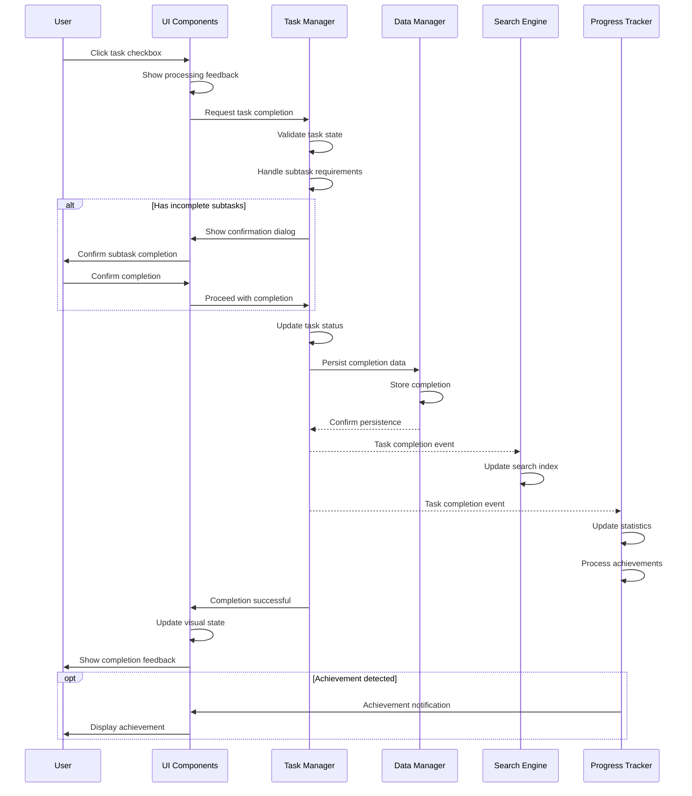

# System Flow: Task Completion - TaskMaster v1.0

## Trigger
User clicks task checkbox to mark as complete.

## Sequence Diagram

## Step-by-Step Timeline

### 1. User Completion Action
**Trigger**: User clicks task checkbox  
**Component**: UI Components  
**Actions**:
- Capture completion request
- Show immediate visual feedback
- Prevent duplicate attempts
- Initiate completion workflow

**Success Response**: Visual feedback confirms action

### 2. Task Completion Validation
**Trigger**: Completion request from UI  
**Component**: Task Manager  
**Actions**:
- Validate task can be completed
- Check subtask completion status
- Verify permissions
- Prepare completion data

**Success Response**: Task validated for completion  
**Failure Scenarios**:
- Task not found → Show error and refresh
- Already completed → Sync UI state
- Incomplete subtasks → Show confirmation dialog

### 3. Subtask Resolution
**Trigger**: Task with incomplete subtasks  
**Component**: Task Manager  
**Actions**:
- Handle subtask completion requirements
- Apply completion to related subtasks
- Update progress tracking

**Success Response**: All subtasks handled

### 4. Task Status Update
**Trigger**: Validated completion  
**Component**: Task Manager  
**Actions**:
- Update status to completed
- Record completion timestamp
- Calculate metrics
- Prepare status change event

**Success Response**: Task status updated

### 5. Data Persistence
**Trigger**: Task status update  
**Component**: Data Manager  
**Actions**:
- Store completion data persistently
- Update related statistics
- Create backup point
- Confirm successful storage

**Success Response**: Task completion persisted  
**Failure Scenarios**:
- Storage limitations → Queue for retry
- Storage errors → Cache changes for retry
- Transaction conflicts → Handle gracefully

### 6. Search Index Update
**Trigger**: Task completion event  
**Component**: Search Engine  
**Actions**:
- Update task status in indexes
- Adjust search result rankings
- Maintain search consistency

**Success Response**: Search reflects completion

### 7. Progress Tracking Update
**Trigger**: Task completion event  
**Component**: Progress Tracker  
**Actions**:
- Update completion statistics
- Recalculate progress metrics
- Check achievement milestones
- Update trend data

**Success Response**: Progress statistics updated

### 8. Achievement Processing
**Trigger**: Progress update  
**Component**: Progress Tracker  
**Actions**:
- Evaluate achievement criteria
- Prepare achievement notifications
- Update progress indicators

**Success Response**: Achievements processed

### 9. UI Visual Updates
**Trigger**: Completion success  
**Component**: UI Components  
**Actions**:
- Apply completion visual effects
- Update task positioning
- Update dashboard counters
- Show completion confirmation

**Success Response**: UI reflects completion

### 10. Achievement Notification
**Trigger**: Achievement detection  
**Component**: UI Components  
**Actions**:
- Display achievement notifications
- Show milestone celebrations
- Update progress dashboard
- Record achievement history

**Success Response**: User sees achievement feedback

## Service Roles

### UI Components
- **Primary**: User interaction handling and visual feedback
- **Secondary**: Completion animations and achievement display
- **Data Flow**: Captures action → Sends to Task Manager → Shows results

### Task Manager
- **Primary**: Task completion logic and workflow coordination
- **Secondary**: Subtask management and validation
- **Data Flow**: Processes completion request → Validates → Updates → Coordinates services

### Data Manager  
- **Primary**: Persistent storage of completion data
- **Secondary**: Data consistency and backup management
- **Data Flow**: Receives completion data → Stores persistently → Confirms success

### Search Engine
- **Primary**: Search index updates for completed tasks
- **Secondary**: Search result ranking adjustments
- **Data Flow**: Receives completion event → Updates indexes → Maintains consistency

### Progress Tracker
- **Primary**: Progress statistics and achievement detection
- **Secondary**: Milestone tracking and user motivation
- **Data Flow**: Receives completion event → Updates metrics → Processes achievements

## Error Scenarios

### Task Completion Conflicts
**Scenario**: Task cannot be completed due to conflicts  
**Response**:
- Show appropriate error messaging
- Maintain task in current state
- Provide retry options
- Handle conflicts gracefully

**Recovery**: User retries or system resolves conflicts

### Subtask Dependencies
**Scenario**: Task has incomplete subtasks requiring completion  
**Response**:
- Show confirmation dialog with subtask status
- Allow user to choose completion strategy
- Handle subtask completion as needed
- Maintain data consistency

**Recovery**: User confirms approach and proceeds

### Storage Limitations
**Scenario**: Unable to persist completion due to storage issues  
**Response**:
- Show storage limitation notifications
- Queue completion for retry
- Maintain local completion state
- Provide cleanup or export options

**Recovery**: User manages storage or automatic retry

### System State Conflicts
**Scenario**: Concurrent modifications create state conflicts  
**Response**:
- Handle state conflicts gracefully
- Show appropriate notifications
- Prevent data loss or corruption
- Maintain system consistency

**Recovery**: System resolves conflicts automatically or with user input