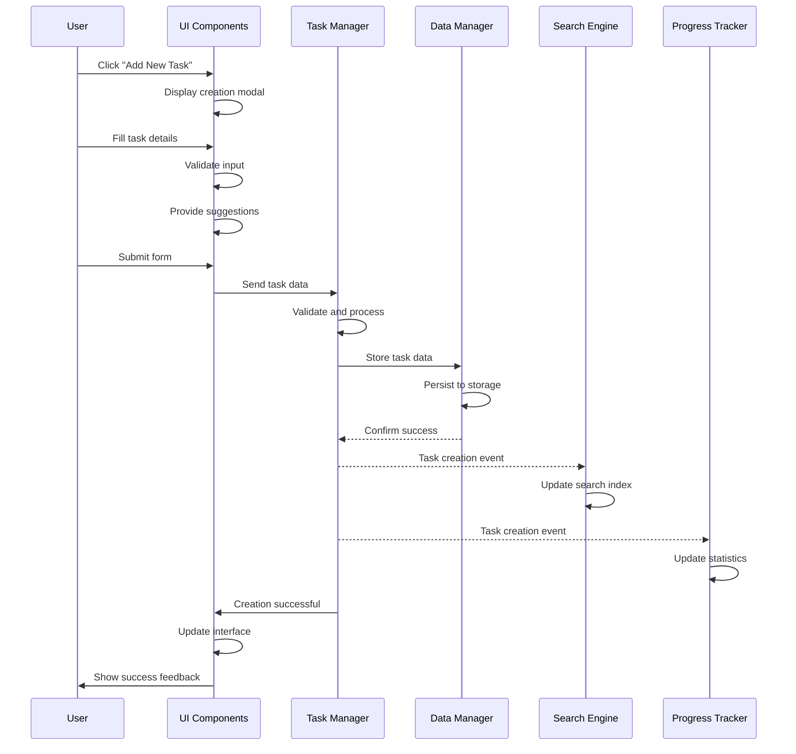

# System Flow: Task Creation - TaskMaster v1.0

## Trigger
User clicks "Add New Task" button or uses keyboard shortcut from the dashboard.

## Sequence Diagram

## Step-by-Step Timeline

### 1. Task Creation Initiation
**Trigger**: User clicks "Add New Task" button  
**Component**: UI Components (Dashboard)  
**Actions**: 
- Display task creation modal
- Initialize form with default values
- Focus on primary input field

**Success Response**: Task creation interface displayed

---

### 2. Form Data Collection
**Trigger**: User fills task creation form  
**Component**: UI Components (Task Creation Modal)  
**Actions**:
- Capture user input for task details
- Provide real-time validation feedback
- Suggest existing categories and tags
- Enable form submission when valid

**Success Response**: Task data ready for processing

---

### 3. Task Data Validation
**Trigger**: User submits task creation form  
**Component**: Task Manager  
**Actions**:
- Validate required and optional fields
- Sanitize and normalize input data
- Resolve category and tag references
- Generate task metadata

**Success Response**: Task data validated and prepared  
**Failure Scenarios**: 
- Missing required fields → Show validation errors
- Invalid data format → Show correction prompts
- Missing category → Apply default category

---

### 4. Task Persistence
**Trigger**: Validated task data from Task Manager  
**Component**: Data Manager  
**Actions**:
- Store task data persistently
- Update related data structures
- Create backup point
- Confirm successful storage

**Success Response**: Task saved successfully  
**Failure Scenarios**:
- Storage limitations → Show storage warning
- Storage errors → Queue for retry
- Offline mode → Store locally for later sync

---

### 5. Search Index Update
**Trigger**: Task creation event from Task Manager  
**Component**: Search Engine  
**Actions**:
- Extract searchable content from task
- Update search indexes
- Maintain search performance optimization

**Success Response**: Task searchable via search interface

---

### 6. Statistics Update
**Trigger**: Task creation event from Task Manager  
**Component**: Progress Tracker  
**Actions**:
- Update task creation statistics
- Recalculate progress metrics
- Update dashboard analytics

**Success Response**: Progress statistics reflect new task

---

### 7. UI Update and Feedback
**Trigger**: Task creation success from Task Manager  
**Component**: UI Components  
**Actions**:
- Close task creation modal
- Display new task in appropriate sections
- Show success feedback to user
- Update task counters and indicators

**Success Response**: User sees new task and confirmation

## Service Roles

### UI Components
- **Primary**: User interaction and form management
- **Secondary**: Validation feedback and success indication
- **Data Flow**: Collects input → Sends to Task Manager → Shows results

### Task Manager
- **Primary**: Task creation business logic and coordination
- **Secondary**: Event distribution to other services
- **Data Flow**: Processes form data → Coordinates persistence → Notifies other services

### Data Manager
- **Primary**: Task data persistence and storage management
- **Secondary**: Backup and recovery operations
- **Data Flow**: Receives task data → Stores persistently → Confirms success

### Search Engine
- **Primary**: Search index maintenance
- **Secondary**: Search optimization
- **Data Flow**: Receives creation event → Updates indexes → Maintains searchability

### Progress Tracker
- **Primary**: Statistics and analytics updates
- **Secondary**: Progress calculation
- **Data Flow**: Receives creation event → Updates metrics → Maintains analytics

## Error Scenarios

### Input Validation Errors
**Scenario**: User submits incomplete or invalid task data  
**Response**: 
- Display specific validation messages
- Keep form open with problematic fields highlighted
- Provide guidance for correction

**Recovery**: User corrects input and resubmits

---

### Storage Limitations
**Scenario**: Storage quota exceeded or storage unavailable  
**Response**:
- Show storage limitation notification
- Provide cleanup or export options
- Queue task creation for later retry

**Recovery**: User manages storage or task is retried automatically

---

### System Conflicts
**Scenario**: Concurrent modifications or system state conflicts  
**Response**:
- Handle conflicts gracefully without data loss
- Show appropriate user notifications
- Maintain system consistency

**Recovery**: System resolves conflicts automatically or with user input

---

*This task creation flow ensures reliable task entry while maintaining system responsiveness and data integrity.*