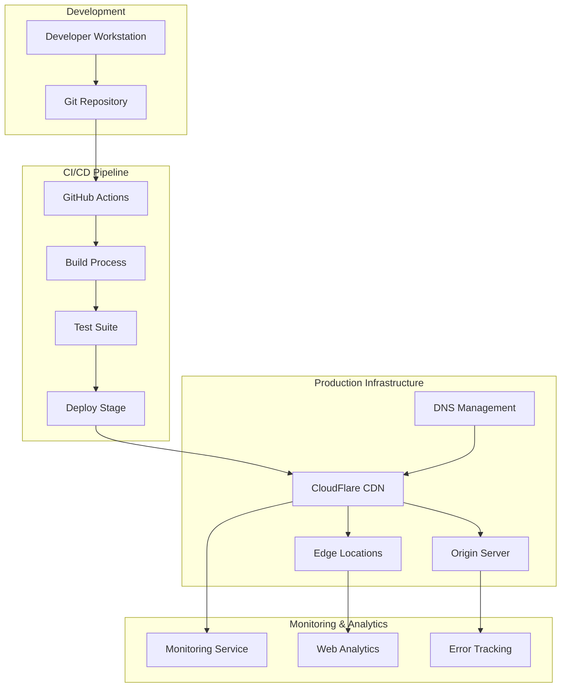

# Infra and DevOps - TaskMaster v1.0

## Deployment Overview

### Architecture Type
**Static Web Application** - Client-side only with no backend services required

### Hosting Strategy
**CDN-based Static Hosting** - Global content delivery with edge caching

### Core Requirements
- Zero server-side dependencies in v1.0
- Progressive Web App capabilities for offline usage
- Global availability with low latency
- HTTPS enforcement for security and PWA requirements
- Automated CI/CD pipeline for deployments

## Infrastructure Architecture



## Hosting Solutions Evaluation

### Primary Choice: Netlify
**Rationale**: Optimal for static sites with PWA support

**Key Benefits**:
- Automatic HTTPS with managed certificates
- Global CDN with worldwide edge caching
- Git integration with automatic deployments
- Branch previews for development workflow
- Built-in form handling for future features
- Environment variable management
- Custom headers and redirects support

**Resource Allocation**:
- Bandwidth: 100GB/month (sufficient for launch scale)
- Build minutes: 300 minutes/month (adequate for CI/CD needs)
- Sites: Unlimited static site hosting
- Custom domains: Full DNS management support

### Backup Option: Vercel
**Alternative platform** with similar static hosting capabilities, serverless functions for future backend needs, and built-in analytics.

### Budget Option: GitHub Pages
**Free hosting solution** with basic static site capabilities, though limited in custom configuration options.

## Build and Deployment Pipeline

### Development Workflow
```
Feature Branch → Main Branch → Production Deploy
(dev/feat)      (main)         (v1.0.x)
     ↓             ↓              ↓
Pull Request   Merge & Test   Tag & Release
Preview Deploy Integration   Production Deploy
```

### CI/CD Strategy
**Platform**: GitHub Actions for automated build and deployment

**Pipeline Stages**:
1. **Code Quality**: Linting and code formatting checks
2. **Testing**: Unit tests and integration test suite
3. **Build**: Application compilation and asset optimization
4. **E2E Testing**: End-to-end functionality verification
5. **Deployment**: Automated deployment to production environment

**Build Tools**: Modern JavaScript build pipeline with code splitting, tree shaking, and PWA optimization

## Configuration Management

### Environment Strategy
- **Development**: Local development with hot reloading
- **Preview**: Branch-based preview deployments
- **Production**: Optimized builds with performance monitoring

### Application Configuration
**Core Settings**:
- Application metadata and versioning
- Storage limits and backup retention policies
- Performance targets for user interactions
- Feature flags for functionality control

### Platform Configuration
**Security Headers**: Content Security Policy, frame protection, content type validation
**Caching Strategy**: Asset optimization with appropriate cache lifetimes
**Routing**: Single-page application routing with fallback handling

## Security Approach

### Content Security Policy
Strict CSP implementation preventing XSS attacks while allowing necessary resources for PWA functionality.

### Data Privacy
- **Local-only storage**: No data transmission to external servers
- **Privacy-first approach**: No analytics tracking in v1.0
- **Minimal dependencies**: Reduced third-party script inclusion
- **User data control**: Full export and deletion capabilities

### Infrastructure Security
- **HTTPS enforcement**: All traffic secured with TLS
- **Security headers**: Protection against common web vulnerabilities
- **Dependency scanning**: Automated vulnerability detection in build pipeline

## Performance Strategy

### Optimization Approach
- **Code splitting**: Feature-based bundle separation
- **Asset optimization**: Compressed images and optimized fonts
- **Caching strategy**: Multi-tier caching for different asset types
- **CDN utilization**: Global edge distribution for reduced latency

### Performance Targets
- **Core Web Vitals**: Meeting Google's performance benchmarks
- **Loading performance**: Sub-3-second initial page load
- **Interaction responsiveness**: Sub-100ms user interaction response

## Monitoring and Observability

### Performance Monitoring
**Core Web Vitals tracking** for user experience optimization with targets for Largest Contentful Paint, First Input Delay, and Cumulative Layout Shift.

### Error Tracking
- **Centralized error monitoring** with privacy-compliant error reporting
- **Automated alerting** for critical issues
- **Privacy-compliant reporting** that respects user data

### Uptime Monitoring
**Service availability monitoring** with multi-region health checks and incident response automation.

## Disaster Recovery

### Backup Strategy
- **Source code**: Git repository with distributed backups
- **Build artifacts**: CI/CD pipeline artifact retention
- **Infrastructure as code**: Deployment configuration versioning

### Recovery Procedures
- **Automated rollback**: Previous version deployment capability
- **Manual recovery**: Step-by-step restoration procedures
- **Business continuity**: Service availability targets and communication plans

## Scaling Considerations

### Current Capacity (v1.0)
- **User capacity**: 10,000+ concurrent users via CDN
- **Storage approach**: Client-side browser storage
- **Geographic reach**: Global CDN distribution
- **Cost structure**: Free-tier hosting for initial launch

### Growth Planning
- **Backend integration**: API services for user accounts and sync
- **Database scaling**: Cloud database for cross-device functionality
- **Authentication**: OAuth integration for user management
- **Real-time features**: WebSocket support for live updates

### Migration Strategy
- **Data migration**: Client-side to cloud database transition plans
- **Feature migration**: Gradual backend service integration
- **User migration**: Seamless upgrade path for existing users

