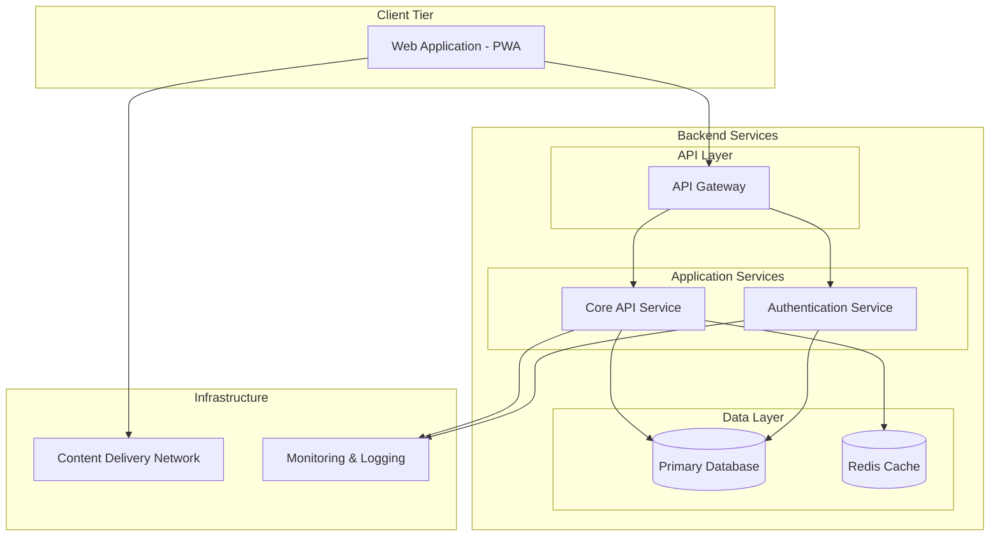

# System Architecture Overview - TaskMaster v1.0

## Purpose
Define TaskMaster v1.0 system architecture: a scalable task management platform with clear frontend/backend separation.

## Design Goals
- **Scalability**: Service-oriented architecture with independent component scaling
- **Performance**: Sub-300ms search, sub-500ms API operations
- **Reliability**: High availability through simplified distributed services
- **Security**: Secure authentication, data protection, access control
- **Maintainability**: Clear service boundaries, reduced complexity
- **User Experience**: Responsive web application with offline capabilities

## Design Decisions and Justifications

| Decision | Rationale | Implementation |
|----------|-----------|----------------|
| Simplified Service Architecture | Core functionality focus, reduced complexity | Core API handles tasks/search, separate auth service |
| API Gateway Pattern | Centralized routing, security, load balancing | Single entry point with request routing |
| Progressive Web App | Cross-platform compatibility, single codebase | Responsive web app with offline capabilities |
| Integrated Search | Simpler architecture, easier maintenance | Search built into core API service |
| Simple Data Layer | Reliability with reduced complexity | Primary database with Redis cache |
| Direct API Communication | Simplified request flow | Synchronous API calls |

## Architecture Diagram

## Component Communication

| Component | Responsibility | Inbound Communications | Outbound Communications |
|-----------|---------------|----------------------|------------------------|
| Web Application (PWA) | User interface, task management interactions, offline functionality. Provides responsive web interface for task creation, editing, and search. | • User interactions (Browser) | • API Gateway (HTTPS) • CDN (HTTPS) |
| API Gateway | Request routing, load balancing, security enforcement. Centralized entry point managing authentication and routing to appropriate services. | • Web Application (HTTPS) | • Authentication Service (HTTP) • Core API Service (HTTP) |
| Authentication Service | User authentication, session management, access control. Handles login, registration, token validation and user permissions. | • API Gateway (HTTP) | • Primary Database (TCP) • Monitoring (HTTP) |
| Core API Service | Task management, search functionality, business logic. Manages task CRUD operations, search indexing, and analytics. | • API Gateway (HTTP) | • Primary Database (TCP) • Redis Cache (TCP) • Monitoring (HTTP) |
| Primary Database | Data persistence, user data, task storage. Maintains all application data with ACID compliance and backup capabilities. | • Authentication Service (TCP) • Core API Service (TCP) | • None |
| Redis Cache | Performance optimization, session storage, search caching. Improves response times for frequently accessed data. | • Core API Service (TCP) | • None |
| CDN | Static asset delivery, global content distribution. Serves application assets and improves loading performance worldwide. | • Web Application (HTTPS) | • None |
| Monitoring & Logging | System observability, performance tracking, error monitoring. Collects metrics and logs for system health analysis. | • Authentication Service (HTTP) • Core API Service (HTTP) | • None |