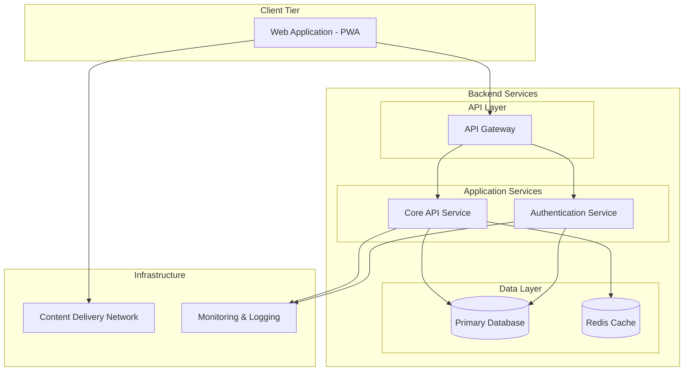

# System Architecture Overview - TaskMaster v1.0

## Purpose
Define TaskMaster v1.0 system architecture: a scalable task management platform with clear frontend/backend separation.

## Design Goals
- **Scalability**: Service-oriented architecture with independent component scaling
- **Performance**: Sub-300ms search, sub-500ms API operations
- **Reliability**: High availability through simplified distributed services
- **Security**: Secure authentication, data protection, access control
- **Maintainability**: Clear service boundaries, reduced complexity
- **User Experience**: Responsive web application with offline capabilities

## Design Decisions and Justifications

| Decision | Rationale | Implementation |
|----------|-----------|----------------|
| Simplified Service Architecture | Core functionality focus, reduced complexity | Core API handles tasks/search, separate auth service |
| API Gateway Pattern | Centralized routing, security, load balancing | Single entry point with request routing |
| Progressive Web App | Cross-platform compatibility, single codebase | Responsive web app with offline capabilities |
| Integrated Search | Simpler architecture, easier maintenance | Search built into core API service |
| Simple Data Layer | Reliability with reduced complexity | Primary database with Redis cache |
| Direct API Communication | Simplified request flow | Synchronous API calls |

## Architecture Diagram

TaskMaster uses simplified service-oriented architecture balancing functionality with maintainability. The PWA provides cross-platform compatibility through responsive interface. Backend includes Authentication Service for user management and Core API Service for task functionality and search. API Gateway handles routing, load balancing, and security. Data layer uses primary database for storage and Redis cache for performance. Infrastructure includes CDN and monitoring.