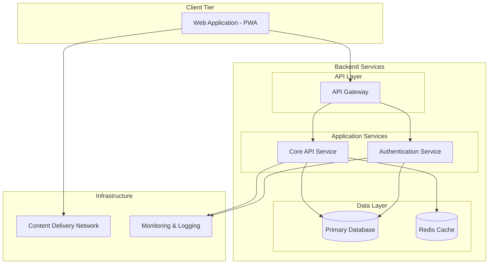

# System Architecture Overview - TaskMaster v1.0

## Purpose
Define the system architecture for TaskMaster v1.0, a task management platform that provides a scalable, simplified system with clear separation between frontend application and backend services to support reliable task management functionality.

## Design Goals
- **Scalability**: Service-oriented architecture supporting independent scaling of core components
- **Performance**: Sub-300ms search response, sub-500ms API operations, efficient data retrieval
- **Reliability**: High availability through simplified distributed services
- **Security**: Secure authentication, data protection, and access control
- **Maintainability**: Clear service boundaries with reduced complexity
- **User Experience**: Responsive web application with offline capabilities

## Design Decisions and Justifications

| Decision | Why It Was Made | How It Will Be Implemented |
|----------|------------------|----------------------------|
| Simplified Service Architecture | Focus on core functionality, reduce complexity | Core API service handles tasks and search, separate auth service |
| API Gateway Pattern | Centralized routing, security, load balancing | Single entry point for all client requests with request routing |
| Progressive Web App | Cross-platform compatibility, single codebase | Responsive web application with offline capabilities |
| Integrated Search | Simpler architecture, easier maintenance | Search functionality built into core API service |
| Simple Data Layer | Reliability with reduced complexity | Primary database with Redis cache for performance |
| Direct API Communication | Simplified request flow | Synchronous API calls between frontend and backend |

## Architecture Diagram

The TaskMaster system architecture follows a simplified service-oriented approach that balances functionality with maintainability. The web application (PWA) provides cross-platform compatibility through a single responsive interface. Backend services are organized into two main components: an Authentication Service for user management and a Core API Service that handles all task-related functionality including search. The API Gateway provides centralized routing, load balancing, and security. The data layer consists of a primary database for persistent storage and Redis cache for performance optimization. Infrastructure components include CDN for content delivery and monitoring for system observability.