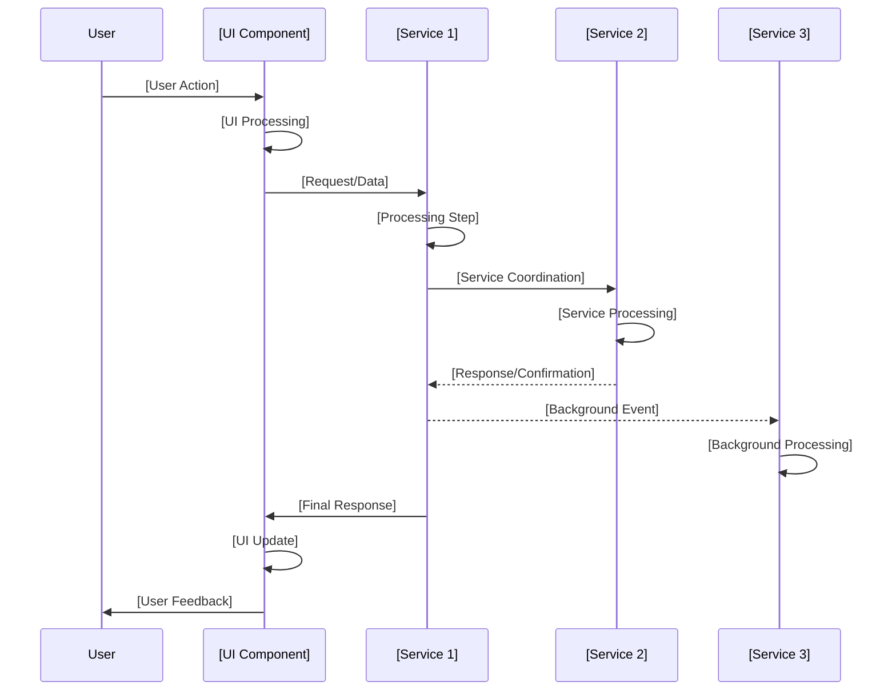

# System Flow: [Flow Name] - [Project Name] [Version]

## Trigger
[Describe the user action, system event, or condition that initiates this flow]

## Sequence Diagram

## Step-by-Step Timeline

### 1. [First Step Name]
**Trigger**: [What triggers this step]  
**Component**: [Which service/component handles this step]  
**Actions**:
- [High-level action 1]
- [High-level action 2]
- [High-level action 3]

**Success Response**: [What indicates success]  
**Failure Scenarios**: [Optional - key failure cases]

---

### 2. [Second Step Name]
**Trigger**: [What triggers this step]  
**Component**: [Which service/component handles this step]  
**Actions**:
- [High-level action 1]
- [High-level action 2]

**Success Response**: [What indicates success]

---

### 3. [Additional Steps]
[Continue pattern for remaining steps in the flow]

## Service Roles

### [Service/Component 1]
- **Primary**: [Main responsibility in this flow]
- **Secondary**: [Supporting responsibilities]
- **Data Flow**: [How data flows through this service]

### [Service/Component 2]
- **Primary**: [Main responsibility in this flow]
- **Secondary**: [Supporting responsibilities]
- **Data Flow**: [How data flows through this service]

### [Service/Component 3]
- **Primary**: [Main responsibility in this flow]
- **Secondary**: [Supporting responsibilities]
- **Data Flow**: [How data flows through this service]

## Error Scenarios

### [Error Type 1]
**Scenario**: [Description of what goes wrong]  
**Response**:
- [High-level response action 1]
- [High-level response action 2]
- [High-level response action 3]

**Recovery**: [How the system/user recovers from this scenario]

---

### [Error Type 2]
**Scenario**: [Description of what goes wrong]  
**Response**:
- [High-level response action 1]
- [High-level response action 2]

**Recovery**: [How the system/user recovers from this scenario]

---

*[Brief closing statement about the flow's purpose and scope]*
