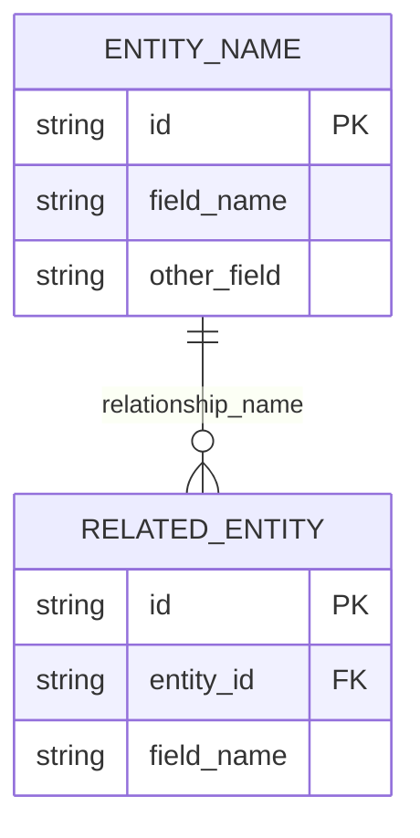

# Entity Relationships - [Project Name] [Version]

## Entity Relationship Diagram

## Data Ownership Map

| Entity | Owning Service | Storage | Read Access | Write Access | Lifecycle |
|--------|----------------|---------|-------------|---------------|-----------|
| **[Entity 1]** | [Service Name] | [Storage Type] | [Access List] | [Write Access] | [Lifecycle Notes] |
| **[Entity 2]** | [Service Name] | [Storage Type] | [Access List] | [Write Access] | [Lifecycle Notes] |

## Entity Relationships and Dependencies

### Core Data Entities

| Relationship | Cardinality | Referential Integrity | Cascade Behavior | Business Rules |
|-------------|-------------|----------------------|------------------|----------------|
| [Entity A] → [Entity B] | [1:Many] | [Integrity rules and constraints] | [ON DELETE CASCADE] | [Business logic implications] |
| [Entity C] → [Entity D] | [1:Many] | [Integrity rules and constraints] | [ON DELETE SET NULL] | [Business logic implications] |

### Derived Data Relationships

| Source → Target | Aggregation Type | Recalculation | Historical Data | Dependencies |
|----------------|------------------|---------------|-----------------|--------------|
| [Source Entity] → [Derived Entity] | [Real-time/Batch] | [When and how updates occur] | [How historical data is maintained] | [What source data affects the derived data] |

### Configuration and State Relationships

| Config Entity → Target | Global Impact | Application | Dependencies |
|------------------------|---------------|-------------|--------------|
| [Config Entity] → [Affected Entities] | [How configuration affects other entities] | [How configuration is applied] | [What depends on this configuration] |

## Access Control and Boundaries

### Service Ownership Boundaries

| Service | Full Control | Read Access | Write Authority | Validation |
|---------|--------------|-------------|-----------------|------------|
| [Service Name] | [List of owned entities] | [Entities this service can read] | [Specific write permissions and rules] | [Business rules and data integrity responsibilities] |
| [Another Service] | [List of owned entities] | [Entities this service can read] | [Specific write permissions and rules] | [Business rules and data integrity responsibilities] |

### Data Flow Patterns

| Pattern Type | Step | Description |
|-------------|------|-------------|
| Write Operations | 1. | [Description of write operation step] |
| | 2. | [Description of validation/processing step] |
| | 3. | [Description of storage/propagation step] |
| | 4. | [Description of notification/update step] |
| Read Operations | 1. | [Description of read request step] |
| | 2. | [Description of access control step] |
| | 3. | [Description of data retrieval step] |
| | 4. | [Description of response formatting step] |
| Cross-Service Communication | | [Description of how services communicate] |
| | | [Description of event-driven updates] |
| | | [How errors are isolated and handled] |
| | | [How consistency is maintained across services] |

---

*This data ownership model ensures secure, consistent data management while maintaining clear service boundaries and supporting the MVP scale of [Project Name] [Version].*
