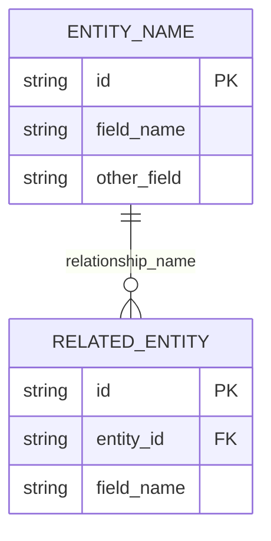

# Entity Relationships - [Project Name] [Version]

## Purpose
Define the data model with entity relationships, ownership boundaries, and access patterns for [Project Name] [Version].

## Entity Relationship Diagram

## Data Ownership Map

| Entity | Owning Service | Storage | Read Access | Write Access | Lifecycle |
|--------|----------------|---------|-------------|---------------|-----------|
| **[Entity 1]** | [Service Name] | [Storage Type] | [Access List] | [Write Access] | [Lifecycle Notes] |
| **[Entity 2]** | [Service Name] | [Storage Type] | [Access List] | [Write Access] | [Lifecycle Notes] |

## Entity Relationships and Dependencies

### Core Data Entities

#### [Entity A] → [Entity B] ([Cardinality])
- **Relationship**: [Description of the relationship]
- **Referential Integrity**: [Integrity rules and constraints]
- **Cascade Behavior**: [What happens on delete/update]
- **Business Rules**: [Any business logic implications]

#### [Entity C] → [Entity D] ([Cardinality])
- **Relationship**: [Description of the relationship]
- **Referential Integrity**: [Integrity rules and constraints]
- **Cascade Behavior**: [What happens on delete/update]
- **Business Rules**: [Any business logic implications]

### Derived Data Relationships

#### [Source Entity] → [Derived Entity] ([Cardinality])
- **Aggregation**: [How derived data is calculated]
- **Recalculation**: [When and how updates occur]
- **Historical Data**: [How historical data is maintained]
- **Dependencies**: [What source data affects the derived data]

### Configuration and State Relationships

#### [Config Entity] → [Affected Entities] ([Cardinality])
- **Global Impact**: [How configuration affects other entities]
- **Application**: [How configuration is applied]
- **Dependencies**: [What depends on this configuration]

## Access Control and Boundaries

### Service Ownership Boundaries

#### [Service Name]
- **Full Control**: [List of owned entities]
- **Read Access**: [Entities this service can read]
- **Write Authority**: [Specific write permissions and rules]
- **Validation**: [Business rules and data integrity responsibilities]

#### [Another Service]
- **Full Control**: [List of owned entities]
- **Read Access**: [Entities this service can read]
- **Write Authority**: [Specific write permissions and rules]
- **Validation**: [Business rules and data integrity responsibilities]

### Data Flow Patterns

#### Write Operations Flow
1. **[Step 1]**: [Description of write operation step]
2. **[Step 2]**: [Description of validation/processing step]
3. **[Step 3]**: [Description of storage/propagation step]
4. **[Step 4]**: [Description of notification/update step]

#### Read Operations Flow
1. **[Step 1]**: [Description of read request step]
2. **[Step 2]**: [Description of access control step]
3. **[Step 3]**: [Description of data retrieval step]
4. **[Step 4]**: [Description of response formatting step]

#### Cross-Service Communication
- **[Communication Pattern 1]**: [Description of how services communicate]
- **[Communication Pattern 2]**: [Description of event-driven updates]
- **[Error Handling]**: [How errors are isolated and handled]
- **[Data Consistency]**: [How consistency is maintained across services]

---

*[Brief closing statement about the data ownership model's purpose and scope]*
