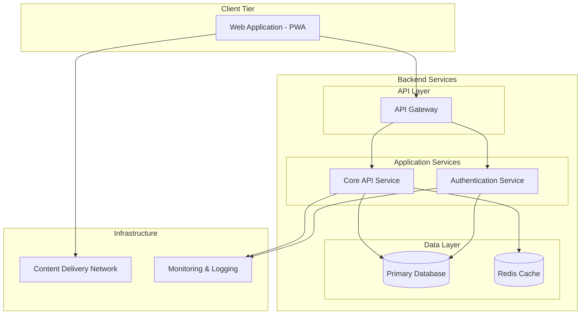

# System Architecture Overview

## Purpose
Summarize the overall system architecture to help frontend and backend engineers plan their implementation. This should reflect UX/product requirements but remain agnostic to UI-level details.

## Design Goals
- [Example] Modularity
- [Example] Security-first architecture
- [Example] High availability
- [Example] Low operational overhead

> Customize based on your project goals.

## Design Decisions and Justifications

| Decision | Why It Was Made | How It Will Be Implemented |
|----------|------------------|----------------------------|
| [e.g., Use external Auth provider] | [e.g., Offload security complexity] | [e.g., Use Supabase/Auth0/etc.] |
| | | |
| | | |

## Architecture Diagram

> System-level architecture diagram focusing on system component/service level (web application, backend services, database, cache instances). Should showcase frontend application and backend services with simplified architecture.

> Brief explanation of how components interact, describing the architecture diagram. Focus on system-level interactions and data flow.
