# Workflow

# Table of Contents

- [Workflow](#workflow)
- [Table of Contents](#table-of-contents)
- [Constants](#constants)
- [Background](#background)
  - [Things to keep in mind](#things-to-keep-in-mind)
  - [Roles in the team](#roles-in-the-team)
  - [Development workflow](#development-workflow)
    - [1. Draft Status](#1-draft-status)
    - [2. Backlog Status](#2-backlog-status)
    - [3. Planned in Sprint Status](#3-planned-in-sprint-status)
    - [4. In-progress Status](#4-in-progress-status)
    - [5. Code Review Status](#5-code-review-status)
    - [6. Integration Testing Status](#6-integration-testing-status)
    - [7. E2E Testing Status](#7-e2e-testing-status)
    - [8. PO Review Status](#8-po-review-status)
    - [9. Security Review Status](#9-security-review-status)
    - [10. Configuring DevOps Status](#10-configuring-devops-status)
    - [11. UAT (User Acceptance Testing) Status](#11-uat-user-acceptance-testing-status)
    - [12. Done Status](#12-done-status)
- [Stage 1 - PRD Definition with UX design](#stage-1---prd-definition-with-ux-design)
  - [1. From an idea to a PRD draft](#1-from-an-idea-to-a-prd-draft)
  - [2. PRD review by stakeholders and amendment](#2-prd-review-by-stakeholders-and-amendment)
  - [3. UX design draft](#3-ux-design-draft)
  - [4. UX design review and amendment](#4-ux-design-review-and-amendment)
  - [5. Update PRD status and link of the UX design](#5-update-prd-status-and-link-of-the-ux-design)
  - [6. Business owner’s review and approval of the PRD](#6-business-owners-review-and-approval-of-the-prd)
- [Stage 2 -  UI Design, stories and system design](#stage-2----ui-design-stories-and-system-design)
  - [7. Stories definition, UI design and System design draft](#7-stories-definition-ui-design-and-system-design-draft)
  - [8. Review stories, UI design and System design by stakeholders and amendment](#8-review-stories-ui-design-and-system-design-by-stakeholders-and-amendment)
  - [9. Finalize stories and plan them into sprints](#9-finalize-stories-and-plan-them-into-sprints)
- [Stage 3 -  Development and testing by sprint](#stage-3----development-and-testing-by-sprint)
  - [10. Run the sprints](#10-run-the-sprints)

# Constants

Below constants will be used as references in below workflow guides.

- `AGENT_CONTEXT_LOCATION` ****= `.agent-context`

- `EXAMPLE_PROJECT_LOCATION` = `{AGENT_CONTEXT_LOCATION}/examples/task-master-project`
- `TEMPLATES_LOCATION` = `{AGENT_CONTEXT_LOCATION}/templates`
- `GUIDELINES_LOCATION` = `{AGENT_CONTEXT_LOCATION}/guidelines`

- `PRD_TEMPLATE` = `{TEMPLATES_LOCATION}/product/PRD-[version].md`
- `PRD_GUIDELINES` = `{GUIDELINES_LOCATION}/product/prd-guidelines.md`
- `PRD_FINAL_EXAMPLE` = `{EXAMPLE_PROJECT_LOCATION}/docs/v1/PRD-1.0-final.md`
- `EPIC_TEMPLATE` = `{TEMPLATES_LOCATION}/product/[version]-epic-[name].md`
- `EPIC_GUIDELINES` = `{GUIDELINES_LOCATION}/product/epic-guidelines.md`
- `EPIC_EXAMPLE` = `{EXAMPLE_PROJECT_LOCATION}/docs/v1/epics/1.0-epic-task-management.md`
- `SPRINT_TEMPLATE` = `{TEMPLATES_LOCATION}/product/sprint-[number].md`
- `SPRINT_GUIDELINES` = `{GUIDELINES_LOCATION}/product/sprint-guidelines.md`
- `SPRINT_EXAMPLE` = `{EXAMPLE_PROJECT_LOCATION}/docs/v1/sprints/sprint-001.md`

- `USER_JOURNEYS_TEMPLATE` = `{TEMPLATES_LOCATION}/ui-ux/user-journeys-[version].md`
- `USER_JOURNEYS_GUIDELINES` = `{GUIDELINES_LOCATION}/ui-ux/user-journeys-guidelines.md`
- `USER_JOURNEYS_EXAMPLE` = `{EXAMPLE_PROJECT_LOCATION}/docs/v1/ui-ux/user-journeys-1.0.md`
- `WIREFRAME_TEMPLATE` = `{TEMPLATES_LOCATION}/ui-ux/wireframes-[version].md`
- `WIREFRAME_GUIDELINES` = `{GUIDELINES_LOCATION}/ui-ux/wireframes-guidelines.md`
- `WIREFRAME_EXAMPLE` = `{EXAMPLE_PROJECT_LOCATION}/docs/v1/ui-ux/wireframes-1.0.md`

- `UI_DESIGN_SYSTEM_TEMPLATE` = `{TEMPLATES_LOCATION}/ui-ux/ui-design-system-[version].md`
- `UI_DESIGN_SYSTEM_GUIDELINES` = `{GUIDELINES_LOCATION}/ui-ux/ui-design-system-guidelines.md`
- `UI_DESIGN_SYSTEM_EXAMPLE` = `{EXAMPLE_PROJECT_LOCATION}/docs/v1/ui-ux/ui-design-system-1.0.md`
- `UI_COMPONENT_LIBRARY_TEMPLATE` = `{TEMPLATES_LOCATION}/ui-ux/ui-component-library-[version].md`
- `UI_COMPONENT_LIBRARY_GUIDELINES` = `{GUIDELINES_LOCATION}/ui-ux/ui-component-library-guidelines.md`
- `UI_COMPONENT_LIBRARY_EXAMPLE` = `{EXAMPLE_PROJECT_LOCATION}/docs/v1/ui-ux/ui-component-library-1.0.md`
- `UI_MOCKUP_GUIDELINES` = `{GUIDELINES_LOCATION}/ui-ux/ui-mockup-guidelines.md`
- `UI_MOCKUP_EXAMPLE` = `{EXAMPLE_PROJECT_LOCATION}/docs/v1/ui-ux/mockups`

- `SYSTEM_ARCHITECTURE_TEMPLATE` = `{TEMPLATES_LOCATION}/architecture/system-architecture-[version].md`
- `SYSTEM_ARCHITECTURE_GUIDELINES` = `{GUIDELINES_LOCATION}/architecture/system-architecture-guidelines.md`
- `SYSTEM_ARCHITECTURE_EXAMPLE` = `{EXAMPLE_PROJECT_LOCATION}/docs/v1/architecture/system-architecture-1.0.md`
- `SERVICE_RESPONSIBILITIES_TEMPLATE` = `{TEMPLATES_LOCATION}/architecture/service-responsibilities-[version].md`
- `SERVICE_RESPONSIBILITIES_GUIDELINES` = `{GUIDELINES_LOCATION}/architecture/service-responsibilities-guidelines.md`
- `SERVICE_RESPONSIBILITIES_EXAMPLE` = `{EXAMPLE_PROJECT_LOCATION}/docs/v1/architecture/service-responsibilities-1.0.md`
- `SYSTEM_FLOWS_TEMPLATE` = `{TEMPLATES_LOCATION}/architecture/system-flow-[version]-[flow-name].md`
- `SYSTEM_FLOWS_GUIDELINES` = `{GUIDELINES_LOCATION}/architecture/system-flows-guidelines.md`
- `SYSTEM_FLOWS_EXAMPLE` = `{EXAMPLE_PROJECT_LOCATION}/docs/v1/architecture/flows/1.0-task-creation-flow.md`
- `DATA_OWNERSHIP_TEMPLATE` = `{TEMPLATES_LOCATION}/architecture/entity-relationships-[version].md`
- `DATA_OWNERSHIP_GUIDELINES` = `{GUIDELINES_LOCATION}/architecture/data-ownership-guidelines.md`
- `DATA_OWNERSHIP_EXAMPLE` = `{EXAMPLE_PROJECT_LOCATION}/docs/v1/architecture/entity-relationships-1.0.md`
- `DEPLOYMENT_PLAN_TEMPLATE` = `{TEMPLATES_LOCATION}/architecture/deployment-plan-[version].md`
- `DEPLOYMENT_PLAN_GUIDELINES` = `{GUIDELINES_LOCATION}/architecture/deployment-plan-guidelines.md`
- `DEPLOYMENT_PLAN_EXAMPLE` = `{EXAMPLE_PROJECT_LOCATION}/docs/v1/architecture/deployment-plan-1.0.md`
- `THREAD_MODEL_TEMPLATE` = `{TEMPLATES_LOCATION}/architecture/[version]-[flow-name]-thread-model.md`
- `THREAD_MODEL_GUIDELINES` = `{GUIDELINES_LOCATION}/architecture/thread-model-guidelines.md`
- `THREAD_MODEL_EXAMPLE` = `{EXAMPLE_PROJECT_LOCATION}/docs/v1/architecture/1.0-user-authentication-thread-model.md`

# Background

## Things to keep in mind

- Given the **business owner,** is the person who sends prompt to the agents. When you ask for a thing from **business owner**, that means you ask for a prompt.
- The version of the template filename is the version of the product requirement. It should follow `[major].[minor]` version format, .e.g `1.0`.
- However, each major version should only have one folder under the `/docs` folder, e.g. `/docs/v1`.
- The folder structure of the documentation should follow `EXAMPLE_PROJECT_LOCATION` , you should mimic that structure **under the root directory of the current repository**.

## Roles in the team

This is a team consisting of the following roles with their detailed responsibilities:

| Role | Responsibilities |
|------|------------------|
| **Product Manager** | Manages product requirements and stakeholder communication: • Drafts PRD documents from business ideas • Facilitates stakeholder reviews and feedback sessions • Updates and refines PRD based on stakeholder input • Summarizes review outcomes and next steps |
| **UX Designer** | Designs user experience and validates design implementation: • Creates user journey flow charts and wireframes • Designs user experience workflows • Reviews and refines designs based on feedback • Validates that final implementation matches design specifications • Collaborates with UI Designer on design system alignment |
| **System Architect** | Defines technical architecture and provides technical guidance: • Reviews PRD for technical feasibility and constraints • Creates system architecture and service responsibilities • Designs system flows and data ownership models • Creates deployment plans and infrastructure requirements • Provides architectural guidance during development • Reviews security expert deliverables for technical alignment |
| **Security Expert** | Ensures security compliance and identifies vulnerabilities: • Identifies early security implications in story drafts • Creates comprehensive threat models • Conducts security assessments and vulnerability scanning • Reviews features for security vulnerabilities • Ensures compliance with security standards |
| **Product Owner** | Manages product backlog and ensures business value delivery: • Reviews PRD for business feasibility and metrics • Creates epics and user stories • Plans stories into sprints based on priority and dependencies • Reviews and prioritizes backlog items • Validates features against business requirements • Facilitates UAT process and stakeholder communication • Makes final feature approval decisions |
| **UI Designer** | Creates visual design system and user interface components: • Develops UI design system and component library • Creates high-fidelity UI mockups in HTML • Updates design reference links in epics • Ensures design consistency across features • Collaborates with UX Designer on user experience |
| **Backend Engineer** | Implements server-side functionality and APIs: • Reviews UI design feasibility from backend perspective • Implements backend features and APIs • Creates unit tests and handles data integration • Addresses security concerns related to data handling • Troubleshoots integration issues and API problems • Collaborates on environment and deployment configuration |
| **Frontend Engineer** | Implements client-side functionality and user interfaces: • Reviews UI design feasibility from frontend perspective • Implements frontend features and user interfaces • Creates unit tests and handles client-side logic • Addresses client-side security issues and data validation • Ensures cross-browser compatibility • Implements responsive design requirements |
| **Code Reviewer** | Ensures code quality and adherence to standards: • Reviews code quality and architecture adherence • Validates security practices and test coverage • Provides feedback for improvement • Ensures coding standards compliance • May consult with System Architect on complex reviews |
| **QA Engineer** | Validates feature quality through comprehensive testing: • Sets up test environments and prepares test cases • Performs manual and automated testing • Conducts integration testing with system components • Executes end-to-end testing across user workflows • Validates cross-browser and performance requirements • Documents and reports testing results |
| **DevOps Engineer** | Manages infrastructure, deployment, and CI/CD processes: • Ensures features are deployed to testing environments • Reviews features for infrastructure requirements • Configures and maintains CI/CD pipelines • Sets up monitoring and alerting for features • Manages production deployments • Collaborates on environment configuration and scripts |

## Development workflow

Here are the flow of the status of a story and the full list of statuses below.

```mermaid
flowchart LR
    Draft[Draft] --> Backlog[Backlog]
    Backlog --> Planned[Planned in Sprint]
    Planned --> InProgress[In-progress]
    InProgress --> CodeReview[Code review]
    CodeReview --> Integration[Integration testing]
    Integration --> E2E[E2E Testing]
    E2E --> POReview[PO review]
    POReview --> SecurityReview[Security review]
    SecurityReview --> ConfiguringDevOps[Configuring DevOps]
    ConfiguringDevOps --> UAT[UAT]
    UAT --> Done[Done]
```

| Status              | Description |
|---------------------|-------------|
| **Draft**           | To be reviewed by stakeholders |
| **Backlog**         | Ready for development |
| **Planned in Sprint** | Placed into a sprint for development |
| **In-progress**     | Development has started |
| **Code review**     | Code being reviewed by the code reviewer |
| **Integration testing** | Feature is being tested by Test Engineer with integration testing |
| **E2E Testing**     | Feature is being tested by QA/Test Engineer with end-to-end testing |
| **PO review**       | Feature review by the product owner |
| **Security review** | Security review by the security expert |
| **Configuring DevOps** | DevOps Engineer checks and configures CI/CD pipeline for the story's system components |
| **UAT**             | User acceptance testing by the "business owner". Ask to review the work before moving it to done. |
| **Done**            | The feature is completed |

### 1. Draft Status

**Assigned to**: Unassigned  
**What happens**: Story has been initially written but needs stakeholder review and refinement.

- **Product Owner**: Reviews story acceptance criteria, ensures alignment with epic goals
- **System Architect**: Assesses technical feasibility and identifies potential architectural concerns
- **Security Expert**: Identifies potential security implications early
- **Frontend/Backend Engineers**: Provide initial technical input on implementation complexity

### 2. Backlog Status

**Assigned to**: Unassigned  
**What happens**: Story has been reviewed, refined, and is ready for sprint planning.

- **Product Owner**: Prioritizes story relative to other backlog items, ensures story is properly sized
- **Engineers**: Story is available for estimation and sprint planning discussions

### 3. Planned in Sprint Status

**Assigned to**: Frontend Engineer / Backend Engineer  
**What happens**: Story has been assigned to a specific engineer and placed in an active sprint.

- **Assigned Engineer**: Reviews story details, clarifies requirements, plans implementation approach
- **Product Owner**: Available for clarifications and requirement discussions
- **System Architect**: Provides architectural guidance if needed

### 4. In-progress Status

**Assigned to**: Frontend Engineer / Backend Engineer  
**What happens**: Active development work is being performed.

- **Assigned Engineer**: Implements feature according to acceptance criteria, writes code, creates unit tests
- **Product Owner**: Available for questions and requirement clarifications during development
- **Other Engineers**: May provide peer assistance or pair programming support

### 5. Code Review Status

**Assigned to**: Code Reviewer  
**What happens**: Implementation is complete and undergoing peer code review.

- **Code Reviewer**: Reviews code quality, architecture adherence, security practices, test coverage
- **Original Engineer**: Addresses review feedback and makes necessary changes
- **System Architect**: May be consulted for architectural review on complex changes

### 6. Integration Testing Status

**Assigned to**: QA Engineer  
**What happens**: Feature is being tested in integration with other system components.

- **QA Engineer**: Tests feature integration with existing functionality, API integrations, data flow
- **Backend Engineer**: Available for integration issues and API-related problems
- **System Architect**: Consulted for complex integration scenarios

### 7. E2E Testing Status

**Assigned to**: QA Engineer  
**What happens**: End-to-end testing across complete user workflows.

- **QA Engineer**: Tests complete user journeys, cross-browser testing, performance validation
- **UX Designer**: Validates that implementation matches design specifications
- **Product Owner**: May perform acceptance testing alongside QA engineer

### 8. PO Review Status

**Assigned to**: Product Owner  
**What happens**: Product owner reviews feature against business requirements.

- **Product Owner**: Validates feature meets acceptance criteria, business requirements, user experience expectations
- **UX Designer**: Collaborates on user experience validation
- **QA Engineer**: Provides testing results and addresses any concerns

### 9. Security Review Status

**Assigned to**: Security Expert  
**What happens**: Security expert reviews feature for potential security vulnerabilities.

- **Security Expert**: Conducts security assessment, vulnerability scanning, compliance check
- **Backend Engineer**: Addresses security concerns related to data handling, APIs, authentication
- **Frontend Engineer**: Addresses client-side security issues, XSS prevention, data validation

### 10. Configuring DevOps Status

**Assigned to**: DevOps Engineer  
**What happens**: DevOps engineer reviews and configures CI/CD pipeline for the feature.

- **DevOps Engineer**: Reviews feature for infrastructure needs, configures deployment pipeline, sets up monitoring
- **System Architect**: Provides guidance on infrastructure and deployment requirements
- **Backend Engineer**: Collaborates on environment configuration and deployment scripts

### 11. UAT (User Acceptance Testing) Status

**Assigned to**: Product Owner  
**What happens**: Final validation by business owner before feature goes live.

- **Business Owner**: Tests feature in production-like environment, validates business value
- **Product Owner**: Facilitates UAT process, documents feedback, makes final approval decision

### 12. Done Status

**Assigned to**: Unassigned  
**What happens**: Feature is completed and ready for production release.

# Stage 1 - PRD Definition with UX design

## 1. From an idea to a PRD draft

Given an idea from scratch / about enhancement/update of an existing product, **product manager** needs to draft the PRD document.

The PRD document should be drafted based on:

- `PRD_TEMPLATE` as the template
- `PRD_GUIDELINES` as the guidelines
- `PRD_FINAL_EXAMPLE` as the example (final version)

Leave section as pending if that is to be completed by another team member, like the UX design reference link.

## 2. PRD review by stakeholders and amendment

Given the drafted PRD document, update the status to **In Review**.

It should be reviewed by:

- **System Architect** - to see if there is any high level technical constraints which requires adjustment to the requirements,
- **Product owner** - to see if the features match the goals and are feasible, whether the metrics / KPIs / Timeline are realistic

After getting reviewed by these stakeholders, **product manager** to ****summarize and update the PRD.

***Until all the stakeholders are fine with the PRD, repeat the above process.***

## 3. UX design draft

**UX designer** to design the

1. *user journeys flow charts* and
2. *wireframes* draft.

The *user journeys flow charts* should be drafted based on:

- `USER_JOURNEYS_TEMPLATE` as the template
- `USER_JOURNEYS_GUIDELINES` as the guidelines
- `USER_JOURNEYS_EXAMPLE` as the example

The *wireframes* should be drafted based on:

- `WIREFRAME_TEMPLATE` as the template
- `WIREFRAME_GUIDELINES` as the guidelines
- `WIREFRAME_EXAMPLE` as the example

## 4. UX design review and amendment

Given the UX design documents drafted, **product manager** to review and give comments.

Then **UX designer** to amend and update accordingly.

***Until product manager is fine with the UX design, repeat the above process.***

## 5. Update PRD status and link of the UX design

**Product manager** to update the status and link of the UX design

## 6. Business owner’s review and approval of the PRD

Ask the **business owner**’s review and approve the PRD. Once it is approved, update the document status to ***Final***.

Otherwise, make changes as instructed by the **business owner.**

---

# Stage 2 -  UI Design, stories and system design

## 7. Stories definition, UI design and System design draft

The following parts work in parallel.

- **Product owner** to create epics and stories under each epic.
The **epics**should be drafted based on:
  - `EPIC_TEMPLATE` as the template
  - `EPIC_GUIDELINES` as the guidelines
  - `EPIC_EXAMPLE` as the example

  The stories should be in `Draft` status.
  
- **UI designer** to create UI design draft including:
    1. **UI design system** - should be drafted based on:
        - `UI_DESIGN_SYSTEM_TEMPLATE` as the template
        - `UI_DESIGN_SYSTEM_GUIDELINES` as the guidelines
        - `UI_DESIGN_SYSTEM_EXAMPLE` as the example
    2. **UI component library** - should be drafted based on:
  - `UI_COMPONENT_LIBRARY_TEMPLATE` as the template
    - `UI_COMPONENT_LIBRARY_GUIDELINES` as the guidelines
    - `UI_COMPONENT_LIBRARY_EXAMPLE` as the example
    3. **High-Fidelity UI mockup in html** - should be drafted based on:
        - `UI_MOCKUP_GUIDELINES` as the guidelines
        - `UI_MOCKUP_EXAMPLE` as the example

- **System Architect** to create system design draft including:
    1. **System architecture** - should be drafted based on:
        - `SYSTEM_ARCHITECTURE_TEMPLATE` as the template
        - `SYSTEM_ARCHITECTURE_GUIDELINES` as the guidelines
        - `SYSTEM_ARCHITECTURE_EXAMPLE` as the example
    2. **Service responsibilities** - should be drafted based on:
        - `SERVICE_RESPONSIBILITIES_TEMPLATE` as the template
        - `SERVICE_RESPONSIBILITIES_GUIDELINES` as the guidelines
        - `SERVICE_RESPONSIBILITIES_EXAMPLE` as the example
    3. **System flows for each key user journey** - should be drafted based on:
        - `SYSTEM_FLOWS_TEMPLATE` as the template
        - `SYSTEM_FLOWS_GUIDELINES` as the guidelines
        - `SYSTEM_FLOWS_EXAMPLE` as the example
    4. **Data ownership** - should be drafted based on:
        - `DATA_OWNERSHIP_TEMPLATE` as the template
        - `DATA_OWNERSHIP_GUIDELINES` as the guidelines
        - `DATA_OWNERSHIP_EXAMPLE` as the example
    5. **Deployment plan** - should be drafted based on:
        - `DEPLOYMENT_PLAN_TEMPLATE` as the template
        - `DEPLOYMENT_PLAN_GUIDELINES` as the guidelines
        - `DEPLOYMENT_PLAN_EXAMPLE` as the example

- **Security Expert** to create security documentation including:
    1. **Threat model** - should be drafted based on:
        - `THREAD_MODEL_TEMPLATE` as the template
        - `THREAD_MODEL_GUIDELINES` as the guidelines
        - `THREAD_MODEL_EXAMPLE` as the example

## 8. Review stories, UI design and System design by stakeholders and amendment

**UI Designer** to update the design reference links in the related epic(s).
**System architect** to attach system design reference links in the related epic(s). Consider anything under `/architecture`.

The following parts work in parallel.

- **Product owner** and **UX Designer** to review the UI design deliverables and also alignment with the stories.
- **Frontend engineer** to review the feasibility of the UI design.
- **Product owner, UX Designer** and **Engineer** to review the deliverables by **System architect**.
- **System architect** to review the deliverables by **Security Expert**.
- **Engineers** to review epics and stories. See if there are any concerns to address, and if they are ready for development.

***Until all the stakeholders are fine with the documents, repeat the above process.***

Once a story is ready, **product owner** should update the status to be `Backlog`.

## 9. Finalize stories and plan them into sprints

**Product owner** to create sprint documents and then plan stories into sprint based on priority and dependencies defined in the epics. The sprint documents should be drafted based on:

- `SPRINT_TEMPLATE` as the template
- `SPRINT_GUIDELINES` as the guidelines
- `SPRINT_EXAMPLE` as the example

Start date and end date should be leave empty as we have not started the sprint yet.

**Product owner** should update the stories which has been placed in a sprint, to status `Planned in Sprint`.

---

# Stage 3 -  Development and testing by sprint

## 10. Run the sprints

At this point, all stories should have the status `Planned in Sprint`. For each sprint, proceed according to the steps outlined in the [Development workflow](#development-workflow) section above. Follow the status transitions and responsibilities for each role as described, moving stories through the workflow from development to completion.

Please note that you can transit from one status back to any previous status if there is/are issue(s) to address/fix. For example, **Code reviewer** can transit the story from `Code review` to `In-progress` and assigned back to the original engineer if some comments in the code is needed to be addressed. **QA Engineer** can transit back to `In-progress` as well if some bugs are found.