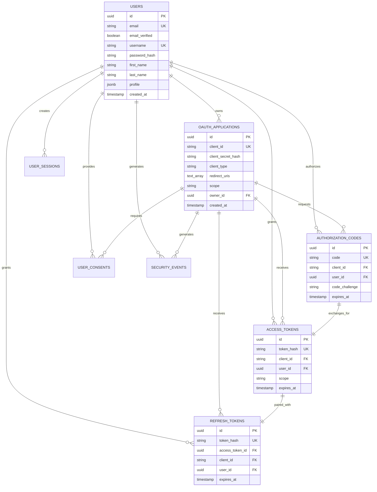

# Database Schema Design

## Schema Overview

The database schema is designed for PostgreSQL with a focus on OAuth 2.0/OpenID Connect compliance, scalability, and cost-effectiveness for small-scale deployments.

## Core Tables

### Users Table
```sql
CREATE TABLE users (
    id UUID PRIMARY KEY DEFAULT gen_random_uuid(),
    email VARCHAR(255) UNIQUE NOT NULL,
    email_verified BOOLEAN DEFAULT FALSE,
    username VARCHAR(50) UNIQUE,
    password_hash VARCHAR(255), -- bcrypt hash
    first_name VARCHAR(100),
    last_name VARCHAR(100),
    phone VARCHAR(20),
    phone_verified BOOLEAN DEFAULT FALSE,
    avatar_url TEXT,
    locale VARCHAR(10) DEFAULT 'en-US',
    timezone VARCHAR(50) DEFAULT 'UTC',
    status VARCHAR(20) DEFAULT 'active', -- active, suspended, deleted
    last_login_at TIMESTAMP WITH TIME ZONE,
    failed_login_attempts INTEGER DEFAULT 0,
    locked_until TIMESTAMP WITH TIME ZONE,
    profile JSONB, -- Additional flexible user attributes
    created_at TIMESTAMP WITH TIME ZONE DEFAULT NOW(),
    updated_at TIMESTAMP WITH TIME ZONE DEFAULT NOW()
);

-- Indexes for performance
CREATE INDEX idx_users_email ON users(email);
CREATE INDEX idx_users_username ON users(username);
CREATE INDEX idx_users_status ON users(status);
CREATE INDEX idx_users_email_verified ON users(email_verified);
CREATE INDEX idx_users_profile ON users USING GIN(profile);
```

### OAuth Applications (Client Applications)
```sql
CREATE TABLE oauth_applications (
    id UUID PRIMARY KEY DEFAULT gen_random_uuid(),
    name VARCHAR(255) NOT NULL,
    client_id VARCHAR(255) UNIQUE NOT NULL,
    client_secret_hash VARCHAR(255), -- bcrypt hash, nullable for public clients
    client_type VARCHAR(20) NOT NULL, -- confidential, public
    grant_types TEXT[] DEFAULT ARRAY['authorization_code'], -- authorization_code, refresh_token, client_credentials
    response_types TEXT[] DEFAULT ARRAY['code'], -- code, token, id_token
    redirect_uris TEXT[] NOT NULL, -- Array of allowed redirect URIs
    allowed_origins TEXT[], -- CORS origins for SPA clients
    scope TEXT DEFAULT 'openid profile email', -- Default scopes
    logo_url TEXT,
    privacy_policy_url TEXT,
    terms_of_service_url TEXT,
    owner_id UUID REFERENCES users(id),
    status VARCHAR(20) DEFAULT 'active', -- active, suspended, deleted
    pkce_required BOOLEAN DEFAULT TRUE, -- Require PKCE for this client
    created_at TIMESTAMP WITH TIME ZONE DEFAULT NOW(),
    updated_at TIMESTAMP WITH TIME ZONE DEFAULT NOW()
);

-- Indexes
CREATE INDEX idx_oauth_apps_client_id ON oauth_applications(client_id);
CREATE INDEX idx_oauth_apps_owner ON oauth_applications(owner_id);
CREATE INDEX idx_oauth_apps_status ON oauth_applications(status);
```

### Authorization Codes
```sql
CREATE TABLE authorization_codes (
    id UUID PRIMARY KEY DEFAULT gen_random_uuid(),
    code VARCHAR(255) UNIQUE NOT NULL,
    client_id VARCHAR(255) NOT NULL REFERENCES oauth_applications(client_id),
    user_id UUID NOT NULL REFERENCES users(id),
    redirect_uri TEXT NOT NULL,
    scope TEXT,
    code_challenge VARCHAR(255), -- PKCE code challenge
    code_challenge_method VARCHAR(10), -- S256, plain
    expires_at TIMESTAMP WITH TIME ZONE NOT NULL,
    used_at TIMESTAMP WITH TIME ZONE,
    created_at TIMESTAMP WITH TIME ZONE DEFAULT NOW()
);

-- Indexes
CREATE INDEX idx_auth_codes_code ON authorization_codes(code);
CREATE INDEX idx_auth_codes_client_user ON authorization_codes(client_id, user_id);
CREATE INDEX idx_auth_codes_expires ON authorization_codes(expires_at);

-- Auto-cleanup expired codes
CREATE INDEX idx_auth_codes_cleanup ON authorization_codes(expires_at) WHERE used_at IS NULL;
```

### Access Tokens
```sql
CREATE TABLE access_tokens (
    id UUID PRIMARY KEY DEFAULT gen_random_uuid(),
    token_hash VARCHAR(255) UNIQUE NOT NULL, -- SHA256 hash of actual token
    client_id VARCHAR(255) NOT NULL REFERENCES oauth_applications(client_id),
    user_id UUID REFERENCES users(id), -- NULL for client_credentials grants
    scope TEXT,
    expires_at TIMESTAMP WITH TIME ZONE NOT NULL,
    revoked_at TIMESTAMP WITH TIME ZONE,
    created_at TIMESTAMP WITH TIME ZONE DEFAULT NOW()
);

-- Indexes
CREATE INDEX idx_access_tokens_hash ON access_tokens(token_hash);
CREATE INDEX idx_access_tokens_client_user ON access_tokens(client_id, user_id);
CREATE INDEX idx_access_tokens_expires ON access_tokens(expires_at);
CREATE INDEX idx_access_tokens_cleanup ON access_tokens(expires_at, revoked_at);
```

### Refresh Tokens
```sql
CREATE TABLE refresh_tokens (
    id UUID PRIMARY KEY DEFAULT gen_random_uuid(),
    token_hash VARCHAR(255) UNIQUE NOT NULL, -- SHA256 hash of actual token
    access_token_id UUID REFERENCES access_tokens(id) ON DELETE CASCADE,
    client_id VARCHAR(255) NOT NULL REFERENCES oauth_applications(client_id),
    user_id UUID NOT NULL REFERENCES users(id),
    scope TEXT,
    expires_at TIMESTAMP WITH TIME ZONE NOT NULL,
    revoked_at TIMESTAMP WITH TIME ZONE,
    used_at TIMESTAMP WITH TIME ZONE, -- For token rotation
    created_at TIMESTAMP WITH TIME ZONE DEFAULT NOW()
);

-- Indexes
CREATE INDEX idx_refresh_tokens_hash ON refresh_tokens(token_hash);
CREATE INDEX idx_refresh_tokens_access ON refresh_tokens(access_token_id);
CREATE INDEX idx_refresh_tokens_client_user ON refresh_tokens(client_id, user_id);
CREATE INDEX idx_refresh_tokens_expires ON refresh_tokens(expires_at);
```

### User Sessions
```sql
CREATE TABLE user_sessions (
    id UUID PRIMARY KEY DEFAULT gen_random_uuid(),
    session_id VARCHAR(255) UNIQUE NOT NULL,
    user_id UUID NOT NULL REFERENCES users(id),
    ip_address INET,
    user_agent TEXT,
    device_fingerprint VARCHAR(255),
    last_activity TIMESTAMP WITH TIME ZONE DEFAULT NOW(),
    expires_at TIMESTAMP WITH TIME ZONE NOT NULL,
    data JSONB, -- Session data storage
    created_at TIMESTAMP WITH TIME ZONE DEFAULT NOW()
);

-- Indexes
CREATE INDEX idx_sessions_session_id ON user_sessions(session_id);
CREATE INDEX idx_sessions_user ON user_sessions(user_id);
CREATE INDEX idx_sessions_expires ON user_sessions(expires_at);
CREATE INDEX idx_sessions_activity ON user_sessions(last_activity);
```

### User Consents (OAuth Scope Approvals)
```sql
CREATE TABLE user_consents (
    id UUID PRIMARY KEY DEFAULT gen_random_uuid(),
    user_id UUID NOT NULL REFERENCES users(id),
    client_id VARCHAR(255) NOT NULL REFERENCES oauth_applications(client_id),
    scope TEXT NOT NULL,
    granted_at TIMESTAMP WITH TIME ZONE DEFAULT NOW(),
    revoked_at TIMESTAMP WITH TIME ZONE,
    
    UNIQUE(user_id, client_id)
);

-- Indexes
CREATE INDEX idx_consents_user_client ON user_consents(user_id, client_id);
CREATE INDEX idx_consents_granted ON user_consents(granted_at) WHERE revoked_at IS NULL;
```

## Security and Audit Tables

### Security Events
```sql
CREATE TABLE security_events (
    id UUID PRIMARY KEY DEFAULT gen_random_uuid(),
    user_id UUID REFERENCES users(id),
    client_id VARCHAR(255) REFERENCES oauth_applications(client_id),
    event_type VARCHAR(50) NOT NULL, -- login_success, login_failed, token_issued, etc.
    ip_address INET,
    user_agent TEXT,
    details JSONB,
    created_at TIMESTAMP WITH TIME ZONE DEFAULT NOW()
);

-- Indexes
CREATE INDEX idx_security_events_user ON security_events(user_id);
CREATE INDEX idx_security_events_type ON security_events(event_type);
CREATE INDEX idx_security_events_created ON security_events(created_at);
CREATE INDEX idx_security_events_ip ON security_events(ip_address);
```

### Rate Limiting
```sql
CREATE TABLE rate_limits (
    id UUID PRIMARY KEY DEFAULT gen_random_uuid(),
    key VARCHAR(255) NOT NULL, -- IP, user_id, client_id, etc.
    bucket VARCHAR(50) NOT NULL, -- auth_attempts, token_requests, etc.
    count INTEGER DEFAULT 1,
    window_start TIMESTAMP WITH TIME ZONE DEFAULT NOW(),
    expires_at TIMESTAMP WITH TIME ZONE NOT NULL,
    
    UNIQUE(key, bucket, window_start)
);

-- Indexes
CREATE INDEX idx_rate_limits_key_bucket ON rate_limits(key, bucket);
CREATE INDEX idx_rate_limits_expires ON rate_limits(expires_at);
```

## Data Relationships Diagram



## Row Level Security (RLS) Policies

For Supabase deployment, implement Row Level Security policies:

```sql
-- Enable RLS on all tables
ALTER TABLE users ENABLE ROW LEVEL SECURITY;
ALTER TABLE oauth_applications ENABLE ROW LEVEL SECURITY;
ALTER TABLE user_sessions ENABLE ROW LEVEL SECURITY;
ALTER TABLE user_consents ENABLE ROW LEVEL SECURITY;

-- Users can only see their own data
CREATE POLICY "Users can view own profile" ON users
    FOR SELECT USING (auth.uid() = id);

CREATE POLICY "Users can update own profile" ON users
    FOR UPDATE USING (auth.uid() = id);

-- Application owners can manage their apps
CREATE POLICY "Owners can manage applications" ON oauth_applications
    FOR ALL USING (auth.uid() = owner_id);

-- Users can see their sessions
CREATE POLICY "Users can view own sessions" ON user_sessions
    FOR SELECT USING (auth.uid() = user_id);

-- Service role has full access for auth operations
CREATE POLICY "Service role full access" ON users
    FOR ALL USING (auth.role() = 'service_role');
```

## Performance Optimization

### Partitioning Strategy (for scale)
```sql
-- Partition security_events by month for better performance
CREATE TABLE security_events_y2025m01 PARTITION OF security_events
    FOR VALUES FROM ('2025-01-01') TO ('2025-02-01');

-- Create index on partitioned table
CREATE INDEX idx_security_events_y2025m01_created 
    ON security_events_y2025m01(created_at);
```

### Cleanup Jobs
```sql
-- Function to clean expired tokens and codes
CREATE OR REPLACE FUNCTION cleanup_expired_tokens()
RETURNS INTEGER AS $$
DECLARE
    deleted_count INTEGER;
BEGIN
    -- Clean expired authorization codes
    DELETE FROM authorization_codes 
    WHERE expires_at < NOW() - INTERVAL '1 hour';
    
    GET DIAGNOSTICS deleted_count = ROW_COUNT;
    
    -- Clean expired access tokens
    DELETE FROM access_tokens 
    WHERE expires_at < NOW() - INTERVAL '1 day';
    
    -- Clean expired sessions
    DELETE FROM user_sessions 
    WHERE expires_at < NOW();
    
    -- Clean old rate limit entries
    DELETE FROM rate_limits 
    WHERE expires_at < NOW();
    
    RETURN deleted_count;
END;
$$ LANGUAGE plpgsql;

-- Schedule cleanup (can be called via cron or application scheduler)
SELECT cron.schedule('cleanup-tokens', '0 */6 * * *', 'SELECT cleanup_expired_tokens();');
```

## Migration Strategy

### Initial Schema Setup
1. Create users table with basic authentication
2. Add OAuth application registration
3. Implement authorization code flow tables
4. Add token management tables
5. Create session and security tables

### Schema Versioning
```sql
CREATE TABLE schema_migrations (
    version VARCHAR(255) PRIMARY KEY,
    applied_at TIMESTAMP WITH TIME ZONE DEFAULT NOW()
);

-- Track applied migrations
INSERT INTO schema_migrations (version) VALUES ('001_initial_schema');
```

This schema design provides:
- **OAuth 2.0/OIDC Compliance**: Full support for standard flows
- **Security**: Proper token hashing, rate limiting, audit trails
- **Scalability**: Indexed for performance, partitioning ready
- **Cost Efficiency**: Optimized for Supabase free tier limits
- **Flexibility**: JSONB fields for extensible user profiles
- **Compliance**: Audit trails and security event logging