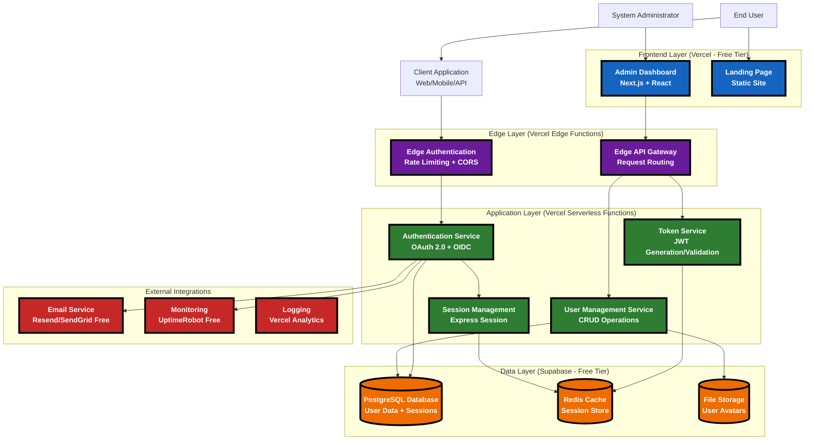
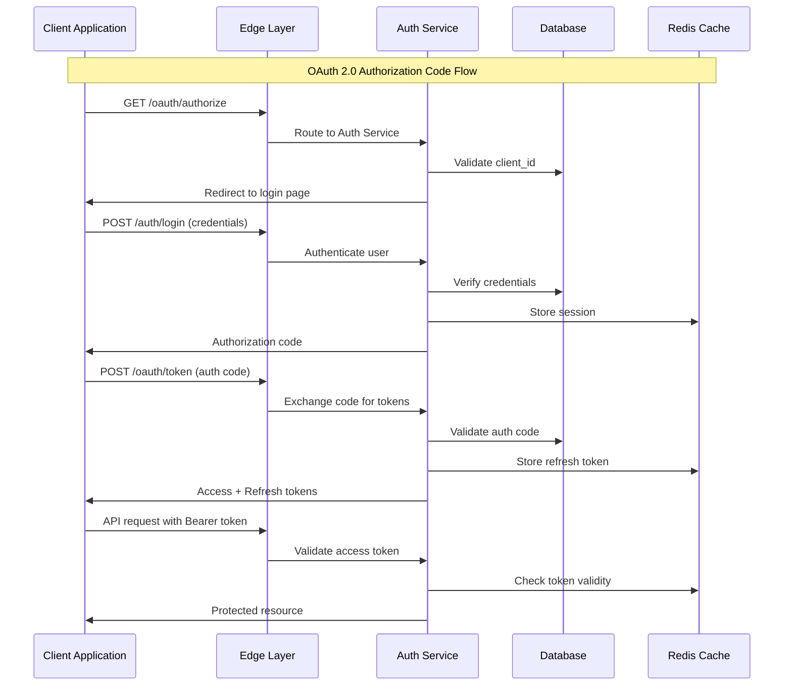
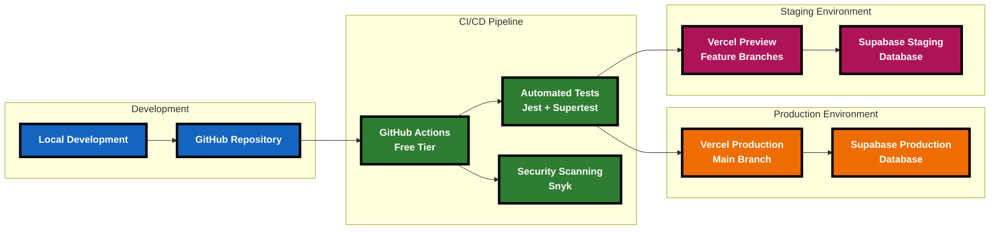
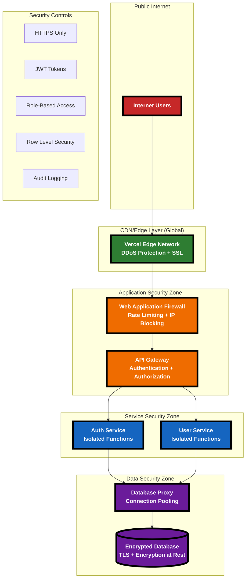

# System Architecture - Cost-Effective Identity Provider

## High-Level System Architecture

### High-Contrast Alternative (HTML Table Format)

<table border="2" style="border-collapse: collapse; width: 100%; font-family: monospace;">
<tr style="background-color: #000000; color: #FFFFFF; font-weight: bold;">
  <td colspan="4" style="text-align: center; padding: 10px; font-size: 16px;">SYSTEM ARCHITECTURE OVERVIEW</td>
</tr>
<tr>
  <td style="background-color: #1565C0; color: #FFFFFF; font-weight: bold; padding: 10px; text-align: center;">FRONTEND LAYER (Vercel Free Tier)</td>
  <td style="background-color: #6A1B9A; color: #FFFFFF; font-weight: bold; padding: 10px; text-align: center;">EDGE LAYER (Vercel Edge Functions)</td>
  <td style="background-color: #2E7D32; color: #FFFFFF; font-weight: bold; padding: 10px; text-align: center;">APPLICATION LAYER (Serverless Functions)</td>
  <td style="background-color: #EF6C00; color: #FFFFFF; font-weight: bold; padding: 10px; text-align: center;">DATA LAYER (Supabase)</td>
</tr>
<tr>
  <td style="background-color: #E3F2FD; padding: 10px; border: 2px solid #1565C0;">
    <strong>Admin Dashboard</strong> 
    • Next.js + React 
    • User Management 
    • System Config  
    <strong>Landing Page</strong> 
    • Static Site 
    • Documentation 
    • Client Registration
  </td>
  <td style="background-color: #F3E5F5; padding: 10px; border: 2px solid #6A1B9A;">
    <strong>Edge Authentication</strong> 
    • Rate Limiting 
    • CORS Handling 
    • Request Validation  
    <strong>Edge API Gateway</strong> 
    • Request Routing 
    • Response Caching 
    • Geographic Distribution
  </td>
  <td style="background-color: #E8F5E8; padding: 10px; border: 2px solid #2E7D32;">
    <strong>Authentication Service</strong> 
    • OAuth 2.0/OIDC 
    • Login/Logout Flows  
    <strong>User Management</strong> 
    • CRUD Operations 
    • Profile Management  
    <strong>Token Service</strong> 
    • JWT Gen/Validation 
    • Refresh Tokens  
    <strong>Session Management</strong> 
    • Server-side Sessions 
    • Security Policies
  </td>
  <td style="background-color: #FFF3E0; padding: 10px; border: 2px solid #EF6C00;">
    <strong>PostgreSQL Database</strong> 
    • User Data 
    • Applications 
    • Sessions  
    <strong>Redis Cache</strong> 
    • Session Storage 
    • Token Blacklist 
    • Rate Limiting  
    <strong>File Storage</strong> 
    • User Avatars 
    • App Logos 
    • Static Assets
  </td>
</tr>
<tr>
  <td colspan="4" style="background-color: #C62828; color: #FFFFFF; font-weight: bold; padding: 8px; text-align: center;">EXTERNAL INTEGRATIONS</td>
</tr>
<tr>
  <td colspan="4" style="background-color: #FFEBEE; padding: 10px; border: 2px solid #C62828;">
    <strong>Email Service:</strong> Resend/SendGrid (Free Tier) • 
    <strong>Monitoring:</strong> UptimeRobot (Free) • 
    <strong>Logging:</strong> Vercel Analytics
  </td>
</tr>
</table>

## Component Responsibilities

### Frontend Layer
- **Admin Dashboard**: User management, system configuration, analytics
- **Landing Page**: Service documentation, developer portal, client registration

### Edge Layer
- **Edge Authentication**: Rate limiting, CORS handling, basic request validation
- **Edge API Gateway**: Request routing, response caching, geographic distribution

### Application Layer
- **Authentication Service**: Core OAuth 2.0/OIDC implementation, login/logout flows
- **User Management Service**: User CRUD operations, profile management, permissions
- **Token Service**: JWT generation, validation, refresh token handling
- **Session Management**: Server-side session handling, security policies

### Data Layer
- **PostgreSQL Database**: Primary data store for users, applications, sessions
- **Redis Cache**: Session storage, token blacklist, rate limiting counters
- **File Storage**: User avatars, application logos, static assets

## Data Flow Architecture

### High-Contrast Data Flow (Step-by-Step)

<table border="3" style="border-collapse: collapse; width: 100%; font-family: monospace;">
<tr style="background-color: #000000; color: #FFFFFF; font-weight: bold;">
  <td style="padding: 10px; text-align: center;">STEP</td>
  <td style="padding: 10px; text-align: center;">FROM</td>
  <td style="padding: 10px; text-align: center;">TO</td>
  <td style="padding: 10px; text-align: center;">ACTION</td>
  <td style="padding: 10px; text-align: center;">PURPOSE</td>
</tr>
<tr style="background-color: #E3F2FD;">
  <td style="padding: 8px; font-weight: bold; border: 2px solid #1565C0;">1</td>
  <td style="padding: 8px; border: 2px solid #1565C0;">Client App</td>
  <td style="padding: 8px; border: 2px solid #1565C0;">Edge Layer</td>
  <td style="padding: 8px; border: 2px solid #1565C0;">GET /oauth/authorize</td>
  <td style="padding: 8px; border: 2px solid #1565C0;">Start OAuth flow</td>
</tr>
<tr style="background-color: #F3E5F5;">
  <td style="padding: 8px; font-weight: bold; border: 2px solid #6A1B9A;">2</td>
  <td style="padding: 8px; border: 2px solid #6A1B9A;">Edge Layer</td>
  <td style="padding: 8px; border: 2px solid #6A1B9A;">Auth Service</td>
  <td style="padding: 8px; border: 2px solid #6A1B9A;">Route request</td>
  <td style="padding: 8px; border: 2px solid #6A1B9A;">Forward to auth handler</td>
</tr>
<tr style="background-color: #E8F5E8;">
  <td style="padding: 8px; font-weight: bold; border: 2px solid #2E7D32;">3</td>
  <td style="padding: 8px; border: 2px solid #2E7D32;">Auth Service</td>
  <td style="padding: 8px; border: 2px solid #2E7D32;">Database</td>
  <td style="padding: 8px; border: 2px solid #2E7D32;">Validate client_id</td>
  <td style="padding: 8px; border: 2px solid #2E7D32;">Verify client exists</td>
</tr>
<tr style="background-color: #FFF3E0;">
  <td style="padding: 8px; font-weight: bold; border: 2px solid #EF6C00;">4</td>
  <td style="padding: 8px; border: 2px solid #EF6C00;">Auth Service</td>
  <td style="padding: 8px; border: 2px solid #EF6C00;">Client App</td>
  <td style="padding: 8px; border: 2px solid #EF6C00;">Redirect to login</td>
  <td style="padding: 8px; border: 2px solid #EF6C00;">Show authentication form</td>
</tr>
<tr style="background-color: #FFEBEE;">
  <td style="padding: 8px; font-weight: bold; border: 2px solid #C62828;">5</td>
  <td style="padding: 8px; border: 2px solid #C62828;">Client App</td>
  <td style="padding: 8px; border: 2px solid #C62828;">Auth Service</td>
  <td style="padding: 8px; border: 2px solid #C62828;">POST credentials</td>
  <td style="padding: 8px; border: 2px solid #C62828;">Submit username/password</td>
</tr>
<tr style="background-color: #E1F5FE;">
  <td style="padding: 8px; font-weight: bold; border: 2px solid #0277BD;">6</td>
  <td style="padding: 8px; border: 2px solid #0277BD;">Auth Service</td>
  <td style="padding: 8px; border: 2px solid #0277BD;">Database</td>
  <td style="padding: 8px; border: 2px solid #0277BD;">Verify credentials</td>
  <td style="padding: 8px; border: 2px solid #0277BD;">Authenticate user</td>
</tr>
<tr style="background-color: #F1F8E9;">
  <td style="padding: 8px; font-weight: bold; border: 2px solid #558B2F;">7</td>
  <td style="padding: 8px; border: 2px solid #558B2F;">Auth Service</td>
  <td style="padding: 8px; border: 2px solid #558B2F;">Redis Cache</td>
  <td style="padding: 8px; border: 2px solid #558B2F;">Store session</td>
  <td style="padding: 8px; border: 2px solid #558B2F;">Create user session</td>
</tr>
<tr style="background-color: #FFF8E1;">
  <td style="padding: 8px; font-weight: bold; border: 2px solid #F57F17;">8</td>
  <td style="padding: 8px; border: 2px solid #F57F17;">Auth Service</td>
  <td style="padding: 8px; border: 2px solid #F57F17;">Client App</td>
  <td style="padding: 8px; border: 2px solid #F57F17;">Return auth code</td>
  <td style="padding: 8px; border: 2px solid #F57F17;">Provide temporary code</td>
</tr>
</table>

## Deployment Architecture

### Deployment Pipeline Flow Chart

DEPLOYMENT ARCHITECTURE FLOW

  

    
DEVELOPMENT

    
• GitHub Repository

    
• Local Development

    
• Feature Branches

  

  
  

    
CI/CD PIPELINE

    
• GitHub Actions

    
• Automated Tests

    
• Security Scanning

  

  
  

    
PRODUCTION

    
• Vercel Production

    
• Supabase Database

    
• Main Branch Deploy

  

  
  

    
STAGING

    
• Vercel Preview

    
• Staging Database

    
• Feature Testing

  

  
PUSH

  
→

  
TEST

  
→

  
DEPLOY

  
→

  
MONITOR

## Network Architecture & Security Boundaries

### Security Architecture - Layered Defense Model

NETWORK SECURITY & BOUNDARIES

<table style="width: 100%; border-collapse: collapse;">
<tr style="background-color: #C62828; color: #fff; font-weight: bold;">
  <td style="padding: 12px; border: 3px solid #000; text-align: center;">LAYER 1: PUBLIC INTERNET</td>
  <td style="padding: 12px; border: 3px solid #000;">• Untrusted traffic • DDoS attacks • Bot traffic</td>
  <td style="padding: 12px; border: 3px solid #000;">• Global access • No filtering • High risk</td>
</tr>
<tr style="background-color: #2E7D32; color: #fff; font-weight: bold;">
  <td style="padding: 12px; border: 3px solid #000; text-align: center;">LAYER 2: CDN/EDGE</td>
  <td style="padding: 12px; border: 3px solid #000;">• SSL termination • DDoS protection • Geographic filtering</td>
  <td style="padding: 12px; border: 3px solid #000;">• 99.9% uptime • Global POPs • Attack mitigation</td>
</tr>
<tr style="background-color: #EF6C00; color: #fff; font-weight: bold;">
  <td style="padding: 12px; border: 3px solid #000; text-align: center;">LAYER 3: APPLICATION</td>
  <td style="padding: 12px; border: 3px solid #000;">• WAF filtering • Rate limiting • IP blocking</td>
  <td style="padding: 12px; border: 3px solid #000;">• Request validation • Auth gateway • Access control</td>
</tr>
<tr style="background-color: #1565C0; color: #fff; font-weight: bold;">
  <td style="padding: 12px; border: 3px solid #000; text-align: center;">LAYER 4: SERVICE</td>
  <td style="padding: 12px; border: 3px solid #000;">• Function isolation • JWT validation • Service mesh</td>
  <td style="padding: 12px; border: 3px solid #000;">• Zero trust • Microservice security • Container isolation</td>
</tr>
<tr style="background-color: #6A1B9A; color: #fff; font-weight: bold;">
  <td style="padding: 12px; border: 3px solid #000; text-align: center;">LAYER 5: DATA</td>
  <td style="padding: 12px; border: 3px solid #000;">• Encryption at rest • TLS in transit • Row-level security</td>
  <td style="padding: 12px; border: 3px solid #000;">• Database firewall • Connection pooling • Audit logging</td>
</tr>
</table>

## Scalability Architecture Phases

### Phase 1: Zero-Cost (0-100 users)
- Single Vercel deployment
- Supabase free tier
- Shared resources

### Phase 2: Low-Cost (100-1K users)
- Vercel Pro tier
- Supabase Pro tier
- Dedicated Redis instance

### Phase 3: Growth Phase (1K-10K users)
- Multi-region deployment
- Database read replicas
- Dedicated monitoring

This architecture prioritizes cost-effectiveness while maintaining professional standards and clear scaling paths.