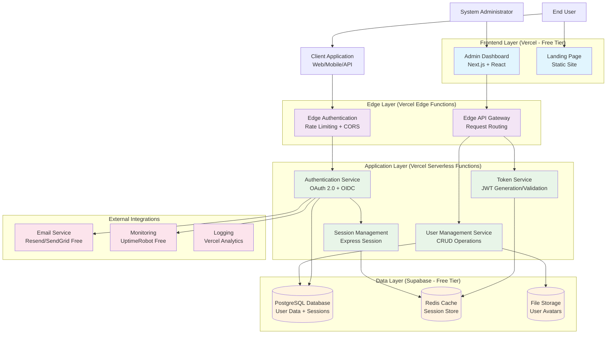
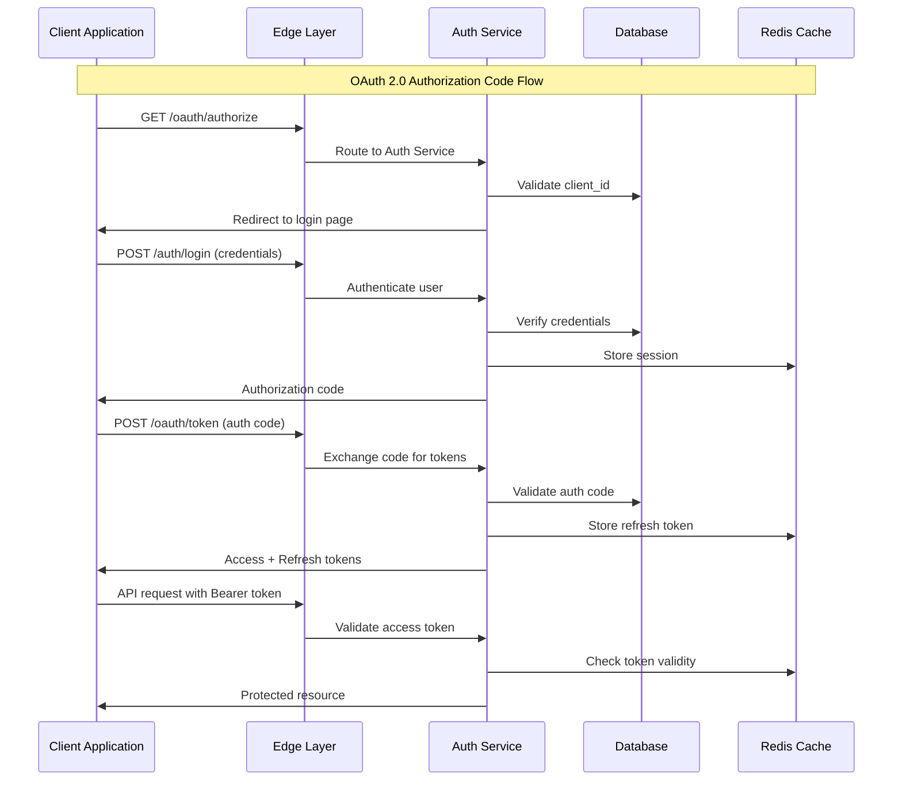
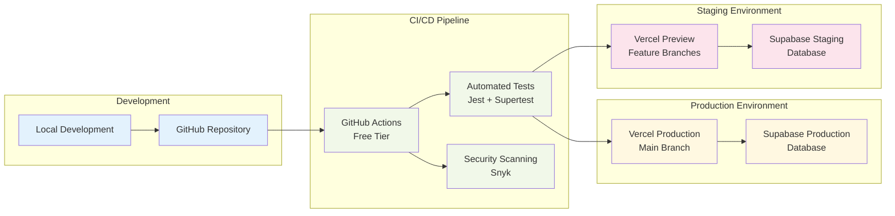
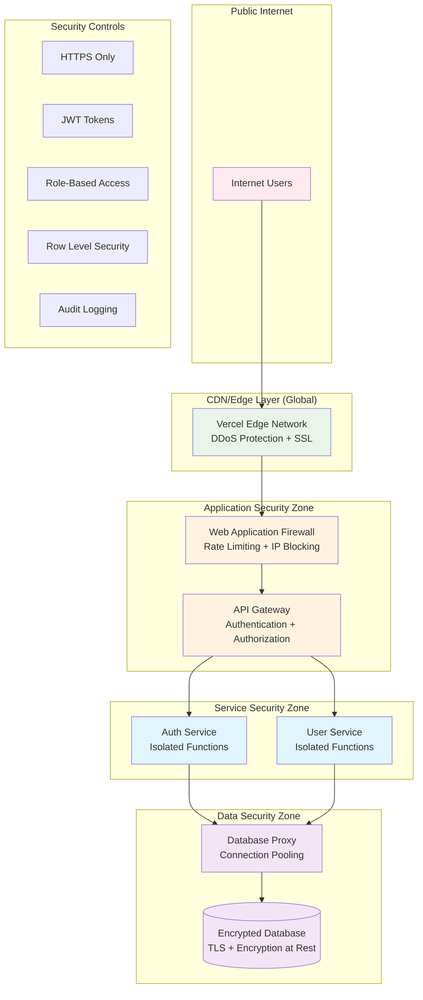

# System Architecture - Cost-Effective Identity Provider

## High-Level System Architecture

## Component Responsibilities

### Frontend Layer
- **Admin Dashboard**: User management, system configuration, analytics
- **Landing Page**: Service documentation, developer portal, client registration

### Edge Layer
- **Edge Authentication**: Rate limiting, CORS handling, basic request validation
- **Edge API Gateway**: Request routing, response caching, geographic distribution

### Application Layer
- **Authentication Service**: Core OAuth 2.0/OIDC implementation, login/logout flows
- **User Management Service**: User CRUD operations, profile management, permissions
- **Token Service**: JWT generation, validation, refresh token handling
- **Session Management**: Server-side session handling, security policies

### Data Layer
- **PostgreSQL Database**: Primary data store for users, applications, sessions
- **Redis Cache**: Session storage, token blacklist, rate limiting counters
- **File Storage**: User avatars, application logos, static assets

## Data Flow Architecture

## Deployment Architecture

## Network Architecture & Security Boundaries

## Scalability Architecture Phases

### Phase 1: Zero-Cost (0-100 users)
- Single Vercel deployment
- Supabase free tier
- Shared resources

### Phase 2: Low-Cost (100-1K users)
- Vercel Pro tier
- Supabase Pro tier
- Dedicated Redis instance

### Phase 3: Growth Phase (1K-10K users)
- Multi-region deployment
- Database read replicas
- Dedicated monitoring

This architecture prioritizes cost-effectiveness while maintaining professional standards and clear scaling paths.