# Scalability Considerations and Growth Path

## Scalability Overview

The Identity Provider architecture is designed with horizontal scalability in mind, starting from zero-cost deployment and providing clear upgrade paths as user base and requirements grow.

## Scaling Dimensions

### User Load Scaling
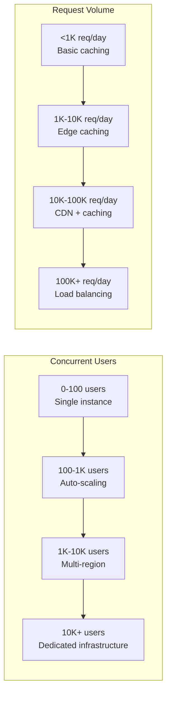

### Data Growth Scaling
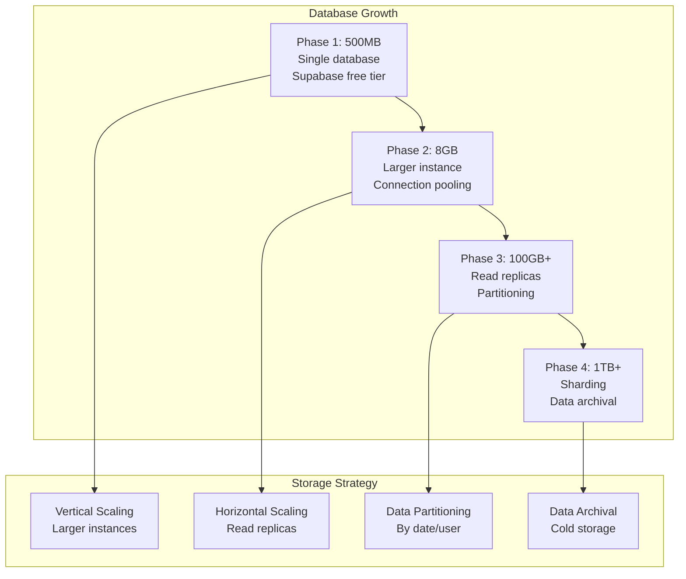

## Scaling Phases

### Phase 1: Zero-Cost Foundation (0-100 Active Users)

**Infrastructure**:
- Vercel free tier (100GB bandwidth, 125K function invocations)
- Supabase free tier (500MB database, 2GB bandwidth)
- GitHub Actions (6K build minutes)

**Performance Characteristics**:
- Response time: <200ms for auth endpoints
- Throughput: ~1K requests/day
- Availability: 99.5% (platform dependent)

**Bottlenecks and Mitigation**:
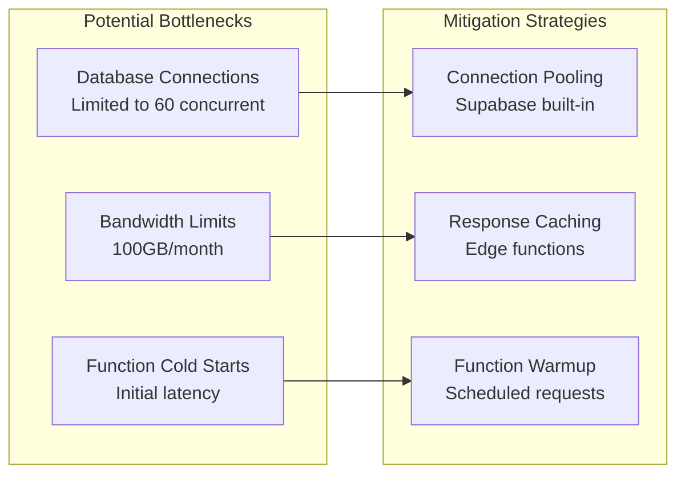

**Monitoring Metrics**:
- Database connection usage
- Function execution time
- Bandwidth consumption
- Error rates

### Phase 2: Paid Tier Transition (100-1K Active Users)

**Infrastructure Upgrades**:
- Vercel Pro ($20/month) - 1TB bandwidth, unlimited functions
- Supabase Pro ($25/month) - 8GB database, 250GB bandwidth
- Redis cache (Redis Cloud free/starter tier)

**Performance Improvements**:
- Response time: <100ms for cached requests
- Throughput: ~10K requests/day
- Availability: 99.9% SLA

**Architecture Enhancements**:
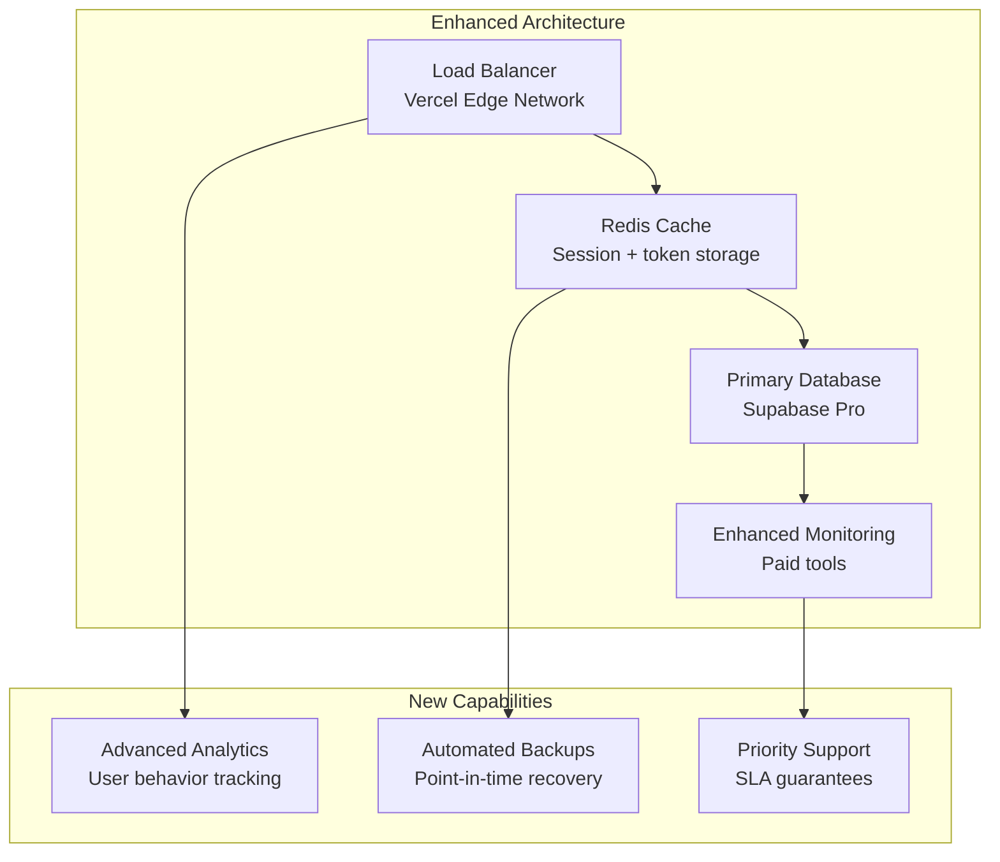

### Phase 3: Multi-Region Growth (1K-10K Active Users)

**Infrastructure Scaling**:
- Multi-region deployment (US, EU, Asia)
- Read replica databases
- Advanced caching strategies
- Dedicated monitoring tools

**Geographic Distribution**:
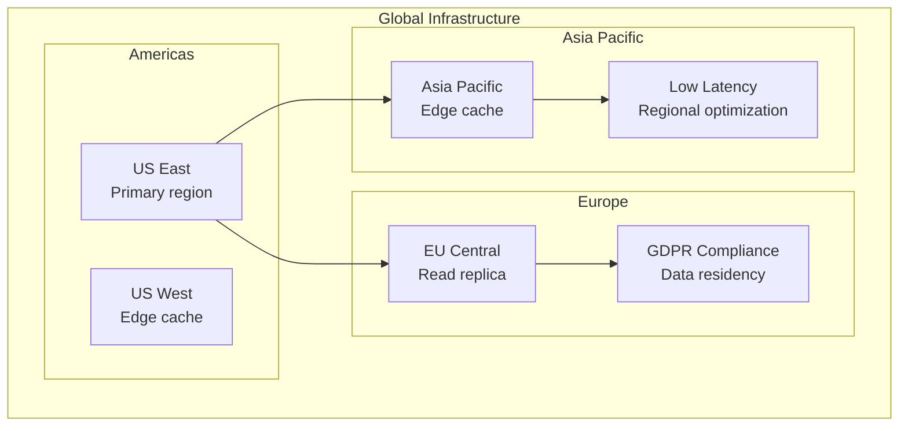

**Performance Characteristics**:
- Response time: <50ms (regional)
- Throughput: ~100K requests/day
- Availability: 99.95% with regional failover

### Phase 4: Enterprise Scale (10K+ Active Users)

**Infrastructure Evolution**:
- Kubernetes-based deployment
- Dedicated database clusters
- Custom CDN configuration
- Advanced security tools

**Enterprise Architecture**:
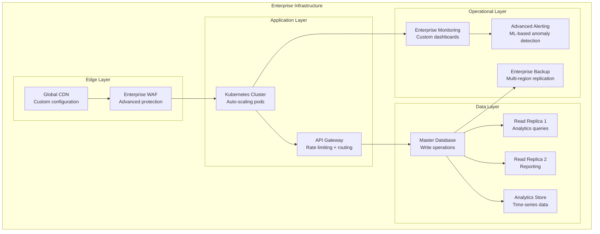

## Performance Optimization Strategies

### Database Optimization
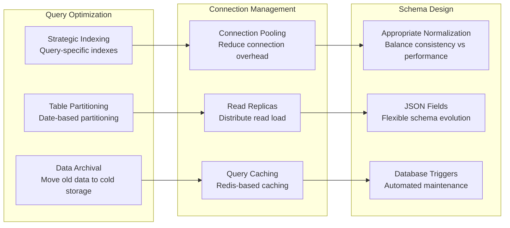

### Application Layer Scaling
```javascript
// Auto-scaling configuration example
const scalingConfig = {
  // Function-level scaling
  functions: {
    '/oauth/token': {
      concurrency: 100,
      timeout: 30000,
      memory: 256
    },
    '/oauth/authorize': {
      concurrency: 200,
      timeout: 15000,
      memory: 128
    }
  },
  
  // Cache configuration
  cache: {
    redis: {
      maxConnections: 50,
      keyPrefix: 'auth:',
      ttl: {
        sessions: 3600,
        tokens: 900,
        userInfo: 300
      }
    },
    edgeCache: {
      static: '1y',
      api: '5m',
      userInfo: '1m'
    }
  },
  
  // Rate limiting
  rateLimit: {
    auth: {
      windowMs: 15 * 60 * 1000,
      max: 5
    },
    api: {
      windowMs: 15 * 60 * 1000,
      max: 1000
    }
  }
};
```

## Cost Optimization Across Scales

### Cost Scaling Model
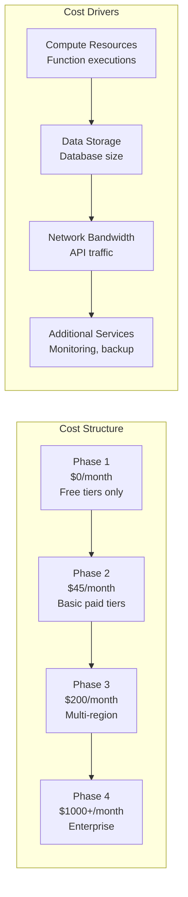

### Cost Optimization Strategies
1. **Resource Right-Sizing**: Monitor usage and adjust instance sizes
2. **Reserved Capacity**: Use reserved instances for predictable workloads
3. **Spot Instances**: Use spot/preemptible instances for non-critical workloads
4. **Data Lifecycle**: Implement data archival and deletion policies
5. **Cache Optimization**: Reduce database load through strategic caching

## Technical Debt Management

### Scaling Technical Debt
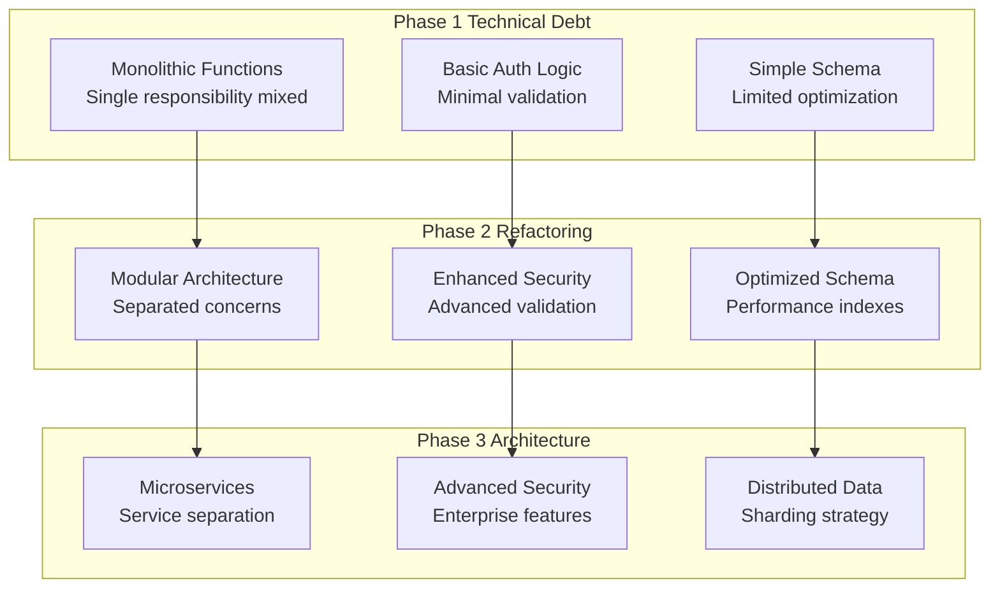

### Migration Strategies
1. **Strangler Fig Pattern**: Gradually replace old components
2. **Database Migration**: Zero-downtime schema changes
3. **Feature Flags**: Control rollout of new functionality
4. **Blue-Green Deployment**: Risk-free deployment strategy
5. **Canary Releases**: Gradual user migration

## Monitoring and Observability Scaling

### Observability Evolution
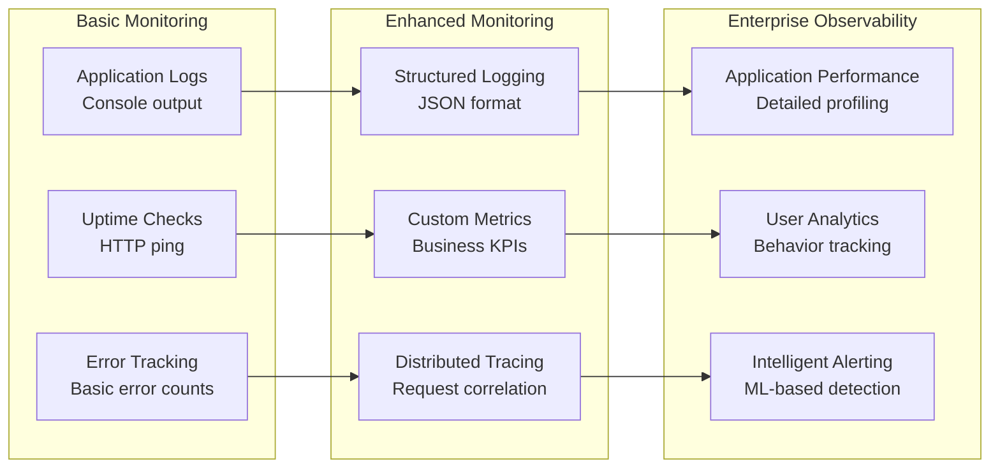

### Key Metrics by Phase
**Phase 1**: Response time, error rate, uptime
**Phase 2**: Throughput, cache hit rate, database performance
**Phase 3**: Regional latency, failover time, user satisfaction
**Phase 4**: Business metrics, cost efficiency, security posture

## Security Scaling Considerations

### Security Evolution
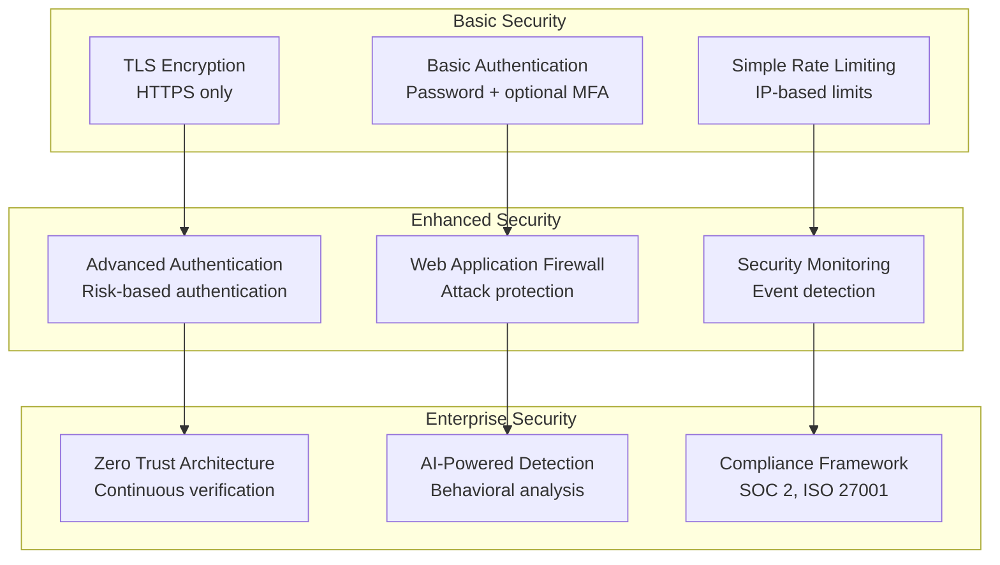

## Capacity Planning

### Planning Methodology
1. **Baseline Metrics**: Establish current performance baselines
2. **Growth Projections**: Model user growth and usage patterns
3. **Load Testing**: Validate system behavior under stress
4. **Bottleneck Analysis**: Identify and address constraints
5. **Scaling Triggers**: Define when to scale each component

### Resource Allocation Formula
```
Required Capacity = (Peak Users × Avg Requests/User × Safety Margin) / Server Capacity
```

**Example Calculation for 1K users**:
- Peak concurrent users: 100 (10% of total)
- Average requests per user per minute: 2
- Safety margin: 50%
- Server capacity: 1000 requests/minute

```
Required Capacity = (100 × 2 × 1.5) / 1000 = 0.3 servers (1 server sufficient)
```

This scalability framework ensures the Identity Provider can grow efficiently from zero cost to enterprise scale while maintaining performance, security, and cost-effectiveness at each phase.