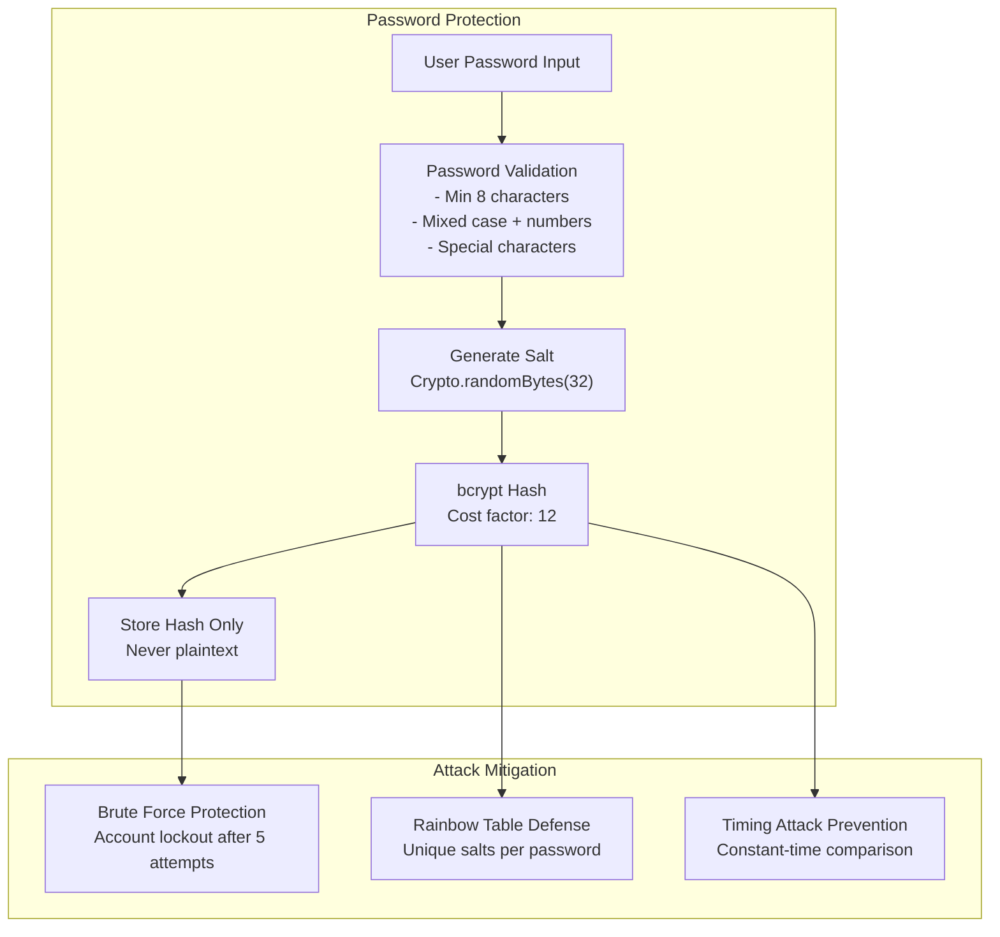
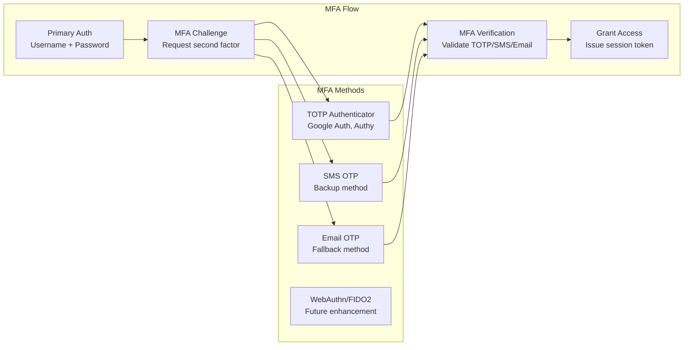
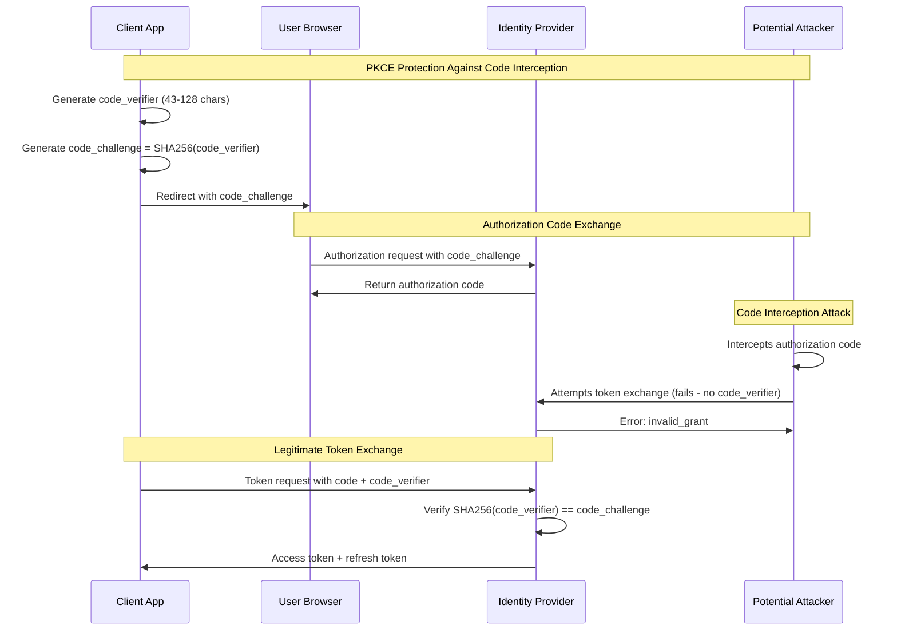
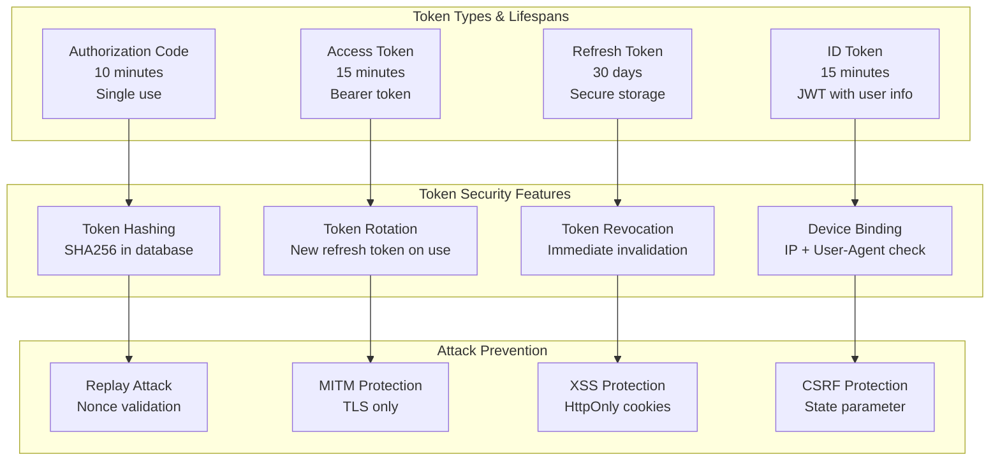
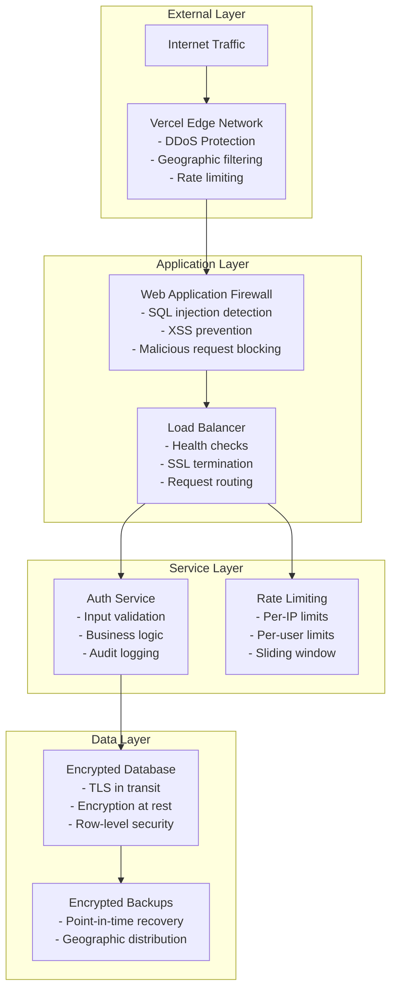
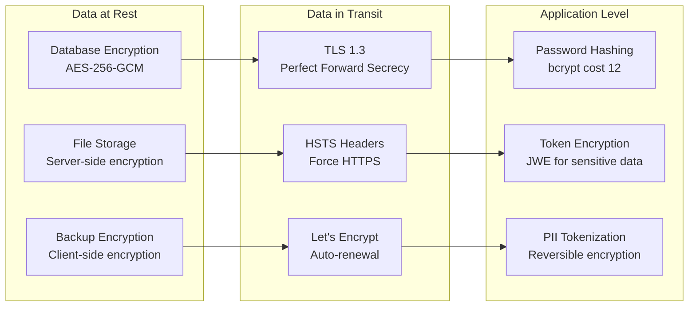
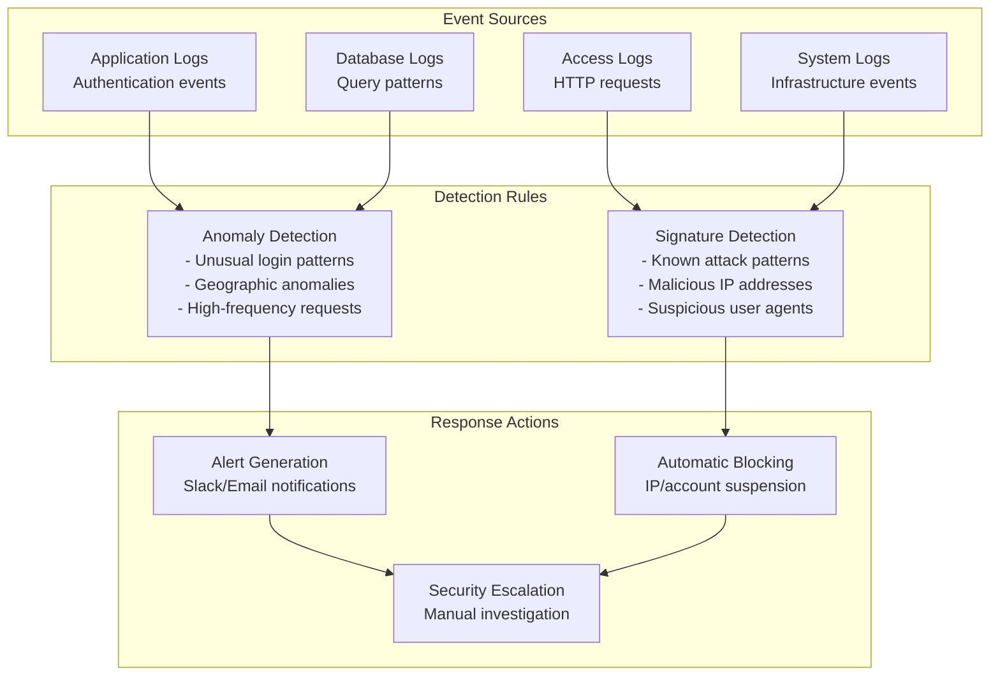
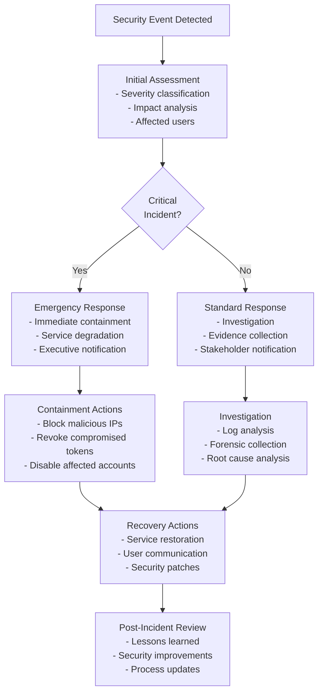
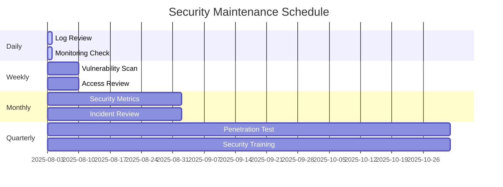

# Security Model and Threat Mitigation

## Security Architecture Overview

The Identity Provider implements defense-in-depth security with multiple layers of protection, focusing on OAuth 2.0/OIDC security best practices while maintaining cost-effectiveness.

## Threat Model

### Assets to Protect
1. **User Credentials**: Passwords, authentication tokens
2. **User Personal Data**: Email, profile information, behavioral data
3. **OAuth Tokens**: Access tokens, refresh tokens, authorization codes
4. **Client Secrets**: OAuth application credentials
5. **System Infrastructure**: Databases, API endpoints, admin interfaces

### Threat Actors
1. **External Attackers**: Malicious actors attempting unauthorized access
2. **Malicious Clients**: Rogue OAuth applications
3. **Insider Threats**: Compromised administrative accounts
4. **Script Kiddies**: Automated attacks, credential stuffing
5. **Nation State**: Advanced persistent threats (lower likelihood for small scale)

## Authentication Security

### Password Security



**Implementation Details**:
- **bcrypt** with cost factor 12 (adjustable based on hardware)
- **Unique salt** per password using crypto-secure randomness
- **Account lockout**: 5 failed attempts → 15 minutes lockout (exponential backoff)
- **Password complexity**: Enforced client-side and server-side
- **Credential breach detection**: Integration with HaveIBeenPwned API

### Multi-Factor Authentication (MFA)


**Security Features**:
- **TOTP**: RFC 6238 compliant, 30-second window, 6-digit codes
- **Backup codes**: 8 single-use recovery codes
- **Device trust**: Remember trusted devices for 30 days
- **Admin enforcement**: Required MFA for admin accounts

## OAuth 2.0 Security

### Authorization Code Flow Security


**PKCE Security Implementation**:
- **Mandatory PKCE**: Required for all OAuth flows
- **Code verifier**: 43-128 character random string
- **Challenge method**: SHA256 only (no 'plain' method)
- **Short-lived codes**: 10-minute expiration
- **Single-use codes**: Invalidated after token exchange

### Token Security Model


**Token Security Implementation**:
- **Access tokens**: Short-lived (15 min), stateless JWT or opaque tokens
- **Refresh tokens**: Long-lived (30 days), stored hashed, single-use with rotation
- **Token binding**: Optional device fingerprinting for enhanced security
- **Revocation endpoint**: Immediate token invalidation capability

## Infrastructure Security

### Network Security


### Rate Limiting Strategy
```javascript
// Rate limiting configuration
const rateLimits = {
  // Authentication endpoints
  '/auth/login': {
    windowMs: 15 * 60 * 1000, // 15 minutes
    max: 5, // 5 attempts per window
    skipSuccessfulRequests: true
  },
  
  // Token endpoints
  '/oauth/token': {
    windowMs: 5 * 60 * 1000, // 5 minutes
    max: 10, // 10 token requests per window
  },
  
  // Registration
  '/api/v1/users/register': {
    windowMs: 60 * 60 * 1000, // 1 hour
    max: 3, // 3 registrations per hour per IP
  },
  
  // General API
  '/api/v1/*': {
    windowMs: 15 * 60 * 1000, // 15 minutes
    max: 1000, // 1000 requests per window
  }
};
```

## Data Protection

### Encryption Standards


### Data Privacy Controls
- **Data minimization**: Collect only necessary user information
- **Purpose limitation**: Use data only for stated purposes
- **Retention limits**: Automatic deletion of inactive accounts after 2 years
- **User control**: Profile export, account deletion, data portability
- **Audit trails**: Comprehensive logging of data access and modifications

## Security Monitoring

### Security Event Detection


### Security Metrics Dashboard
Key metrics to monitor:
- **Failed login attempts**: Spike detection
- **Token usage patterns**: Unusual API access
- **Geographic distribution**: Login location analysis
- **Client application health**: Error rates, response times
- **Database performance**: Query patterns, connection counts

## Incident Response

### Security Incident Playbook


### Breach Notification Procedures
- **Internal notification**: Within 1 hour of detection
- **User notification**: Within 72 hours for personal data breaches
- **Regulatory notification**: As required by local data protection laws
- **Public disclosure**: If breach affects >500 users or system integrity

## Compliance and Standards

### Security Standards Compliance
- **OAuth 2.0 Security Best Practices** (RFC 6749, RFC 6819)
- **OpenID Connect Security Considerations** (OIDC Specification)
- **OWASP Top 10** mitigation strategies
- **NIST Cybersecurity Framework** alignment
- **ISO 27001** security controls (subset applicable to small organizations)

### Regular Security Activities


### Free Security Tools Integration
- **Snyk**: Dependency vulnerability scanning
- **GitHub Security Advisories**: Code security analysis
- **OWASP ZAP**: Automated security testing
- **SSL Labs**: SSL/TLS configuration testing
- **Mozilla Observatory**: Security header analysis

## Cost-Effective Security Measures

### Zero-Cost Security Enhancements
1. **Security Headers**: Implemented via middleware
2. **Rate Limiting**: Application-level implementation
3. **Input Validation**: Server-side validation layers
4. **Audit Logging**: Structured logging to free tiers
5. **Security Scanning**: GitHub Actions with free tools

### Low-Cost Premium Security
- **Web Application Firewall**: Cloudflare free tier
- **DDoS Protection**: Included with Vercel/Netlify
- **SSL Certificates**: Let's Encrypt (free)
- **Security Monitoring**: UptimeRobot free tier
- **Backup Encryption**: Built into cloud providers

This security model provides enterprise-grade protection while maintaining cost-effectiveness, ensuring the Identity Provider can securely serve small-scale applications with a clear path for security scaling as the service grows.