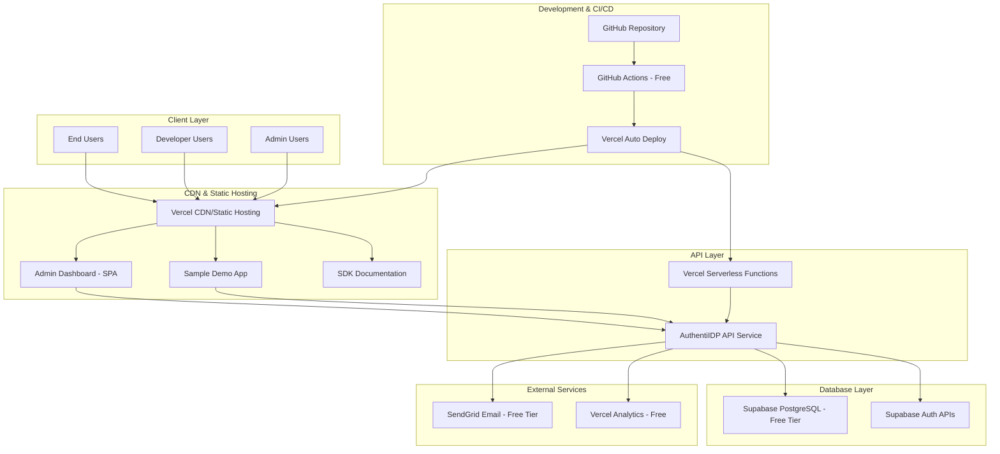

# Deployment Plan - AuthentiIDP v1.0

## Purpose
Define the cost-optimized deployment strategy for AuthentiIDP v1.0 MVP, leveraging free tier services to achieve zero operational costs while maintaining scalability for future growth.

## Deployment Overview

### Architecture Type
Monolithic API service with separate frontend applications - simplified deployment with clear separation between API service, admin dashboard, and client SDKs.

### Hosting Strategy
Cloud-native deployment using free tier services with automatic scaling and global distribution for optimal performance and cost efficiency.

### Core Requirements
- Zero operational cost for MVP using free tier services
- Support for up to 50 concurrent users as per PRD specifications
- SSL/TLS security for all endpoints and data transmission
- Automatic scaling within free tier limitations
- Global availability through CDN distribution
- Email delivery capability for verification and password reset

## Infrastructure Architecture

## Platform Evaluation

### Primary Choice: Vercel + Supabase Stack
**Rationale**: Optimal combination of free tier resources, developer experience, and automatic scaling capabilities perfectly aligned with MVP requirements.

**Key Benefits**:
- Zero cost for MVP scale (up to 50 users, 100GB bandwidth, 500GB storage)
- Automatic HTTPS and global CDN distribution
- Serverless scaling eliminates server management overhead
- Integrated PostgreSQL database with built-in authentication APIs
- Seamless CI/CD with GitHub integration
- Built-in monitoring and analytics

**Resource Requirements**:
- Vercel Free Tier: 100GB bandwidth/month, unlimited static deployments
- Supabase Free Tier: 500MB database, 2GB bandwidth, 50MB file storage
- SendGrid Free Tier: 100 emails/day
- GitHub Actions: 2,000 minutes/month of CI/CD

### Alternative Options
- **Netlify + PlanetScale**: Similar capabilities but less integrated database authentication
- **Railway + Railway DB**: Simpler deployment but limited free tier database storage
- **Heroku + Heroku Postgres**: More expensive after free tier, less modern developer experience

## Build and Deployment Pipeline

### Development Workflow
Feature branch development → Pull Request → Automated testing → Merge to main → Automatic deployment to production

### CI/CD Strategy
**Platform**: GitHub Actions with Vercel integration

**Pipeline Stages**:
1. **Build & Test**: Install dependencies, run unit tests, build application
2. **Security Scan**: Dependency vulnerability scanning, code security analysis
3. **Deploy Preview**: Automatic preview deployment for pull requests
4. **Production Deploy**: Automatic deployment to production on main branch merge

**Build Approach**: Node.js based build process with TypeScript compilation, React bundling, and API service packaging for serverless deployment

## Configuration Management

### Environment Strategy
- **Development**: Local development with Docker Compose for database
- **Preview**: Automatic preview environments for each pull request
- **Production**: Single production environment with monitoring and alerting

### Application Configuration
Environment variables managed through Vercel dashboard with secure secret storage for API keys, database connections, and third-party service credentials.

### Platform Configuration
Infrastructure-as-code approach using Vercel configuration files and Supabase database migrations with version control integration.

## Security Approach

### SSL/TLS and Network Security
Automatic HTTPS certificate management through Vercel with HTTP to HTTPS redirection and secure headers configuration.

### Authentication Security
JWT token signing with RSA-256, refresh token rotation, secure HttpOnly cookie configuration, and rate limiting on authentication endpoints.

### Data Protection
Database encryption at rest through Supabase, secure environment variable management, and input validation at API endpoints.

### Access Control
Role-based access control for admin functions, API key management for application authentication, and audit logging for security events.

## Performance Strategy

### Optimization Approach
Global CDN distribution for static assets, serverless function edge deployment, database query optimization with appropriate indexing, and client-side caching strategies.

### Performance Targets
- API response times under 200ms for authentication operations
- Static asset loading under 1 second globally
- Database query performance under 100ms for user authentication
- Frontend application loading under 2 seconds on 3G connections

## Monitoring and Observability

### Application Monitoring
Vercel Analytics for traffic and performance metrics, Supabase built-in monitoring for database performance, and custom logging for authentication events.

### Error Tracking
Structured logging with appropriate log levels, error aggregation and alerting through Vercel dashboard, and performance monitoring with threshold alerts.

### Security Monitoring
Authentication failure tracking, rate limiting monitoring, and audit log analysis for security events and anomalies.

## Disaster Recovery

### Backup Strategy
Automated daily database backups through Supabase with 7-day retention, configuration backup through version control, and documentation backup in repository.

### Recovery Procedures
Database point-in-time recovery through Supabase dashboard, application redeployment through Git commit rollback, and configuration restoration through environment variable management.

### Business Continuity
RTO (Recovery Time Objective): 15 minutes for application restoration, RPO (Recovery Point Objective): 24 hours for data recovery maximum loss.

## Scaling Considerations

### Current Capacity
Free tier supports 50 concurrent users with 500MB database storage and 100GB monthly bandwidth allocation suitable for MVP requirements.

### Growth Planning
**50-500 Users**: Upgrade to Supabase Pro ($25/month) for increased database capacity and performance
**500-5000 Users**: Add Vercel Pro ($20/month) for increased bandwidth and better performance monitoring
**5000+ Users**: Consider dedicated infrastructure with proper load balancing and database optimization

### Scaling Triggers
- Database storage approaching 400MB (80% of free tier limit)
- Monthly bandwidth exceeding 80GB (80% of free tier limit)
- API response times consistently above 500ms
- User registration rate requiring more than 100 emails/day

### Migration Strategy
All services support seamless tier upgrades with no downtime, database migration through standard PostgreSQL tools, and configuration management through environment variables allowing for smooth transitions.

---

*This deployment plan ensures AuthentiIDP v1.0 MVP launches with zero operational costs while maintaining professional-grade security, performance, and scalability for future growth.*