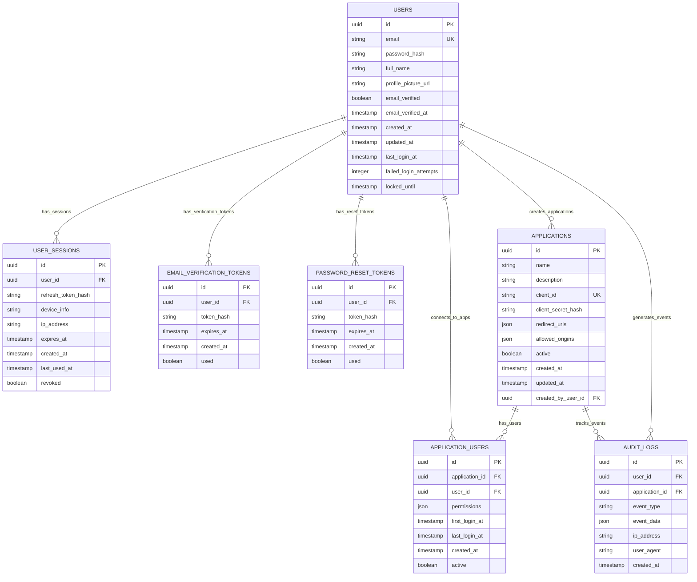

# Entity Relationships - AuthentiIDP v1.0

## Purpose
Define the data model with entity relationships, ownership boundaries, and access patterns for AuthentiIDP v1.0 centralized identity provider service.

## Entity Relationship Diagram

## Data Ownership Map

| Entity | Owning Service | Storage | Read Access | Write Access | Lifecycle |
|--------|----------------|---------|-------------|---------------|-----------|
| **USERS** | AuthentiIDP API | PostgreSQL | API Service, Admin Dashboard | API Service Only | Created on registration, soft-deleted on account deletion |
| **APPLICATIONS** | AuthentiIDP API | PostgreSQL | API Service, Admin Dashboard, Application Owners | API Service Only | Created via Admin Dashboard, marked inactive on deletion |
| **USER_SESSIONS** | AuthentiIDP API | PostgreSQL | API Service Only | API Service Only | Created on login, expired/revoked on logout or timeout |
| **EMAIL_VERIFICATION_TOKENS** | AuthentiIDP API | PostgreSQL | API Service Only | API Service Only | Short-lived (24 hours), auto-deleted after use |
| **PASSWORD_RESET_TOKENS** | AuthentiIDP API | PostgreSQL | API Service Only | API Service Only | Short-lived (1 hour), auto-deleted after use |
| **APPLICATION_USERS** | AuthentiIDP API | PostgreSQL | API Service, Admin Dashboard | API Service Only | Created on first app access, tracks user-app relationship |
| **AUDIT_LOGS** | AuthentiIDP API | PostgreSQL | API Service, Admin Dashboard | API Service Only | Append-only, retained for compliance and monitoring |

## Entity Relationships and Dependencies

### Core Data Entities

#### USERS → USER_SESSIONS (1:Many)
- **Relationship**: Each user can have multiple active sessions across different devices and applications
- **Referential Integrity**: Sessions are deleted when user account is deleted
- **Cascade Behavior**: ON DELETE CASCADE for user deletion, manual cleanup for session expiration
- **Business Rules**: Maximum 10 concurrent sessions per user, oldest sessions revoked automatically

#### USERS → APPLICATIONS (1:Many)
- **Relationship**: Users can create and manage multiple applications through the admin dashboard
- **Referential Integrity**: Applications retain created_by_user_id even if creator account is deleted
- **Cascade Behavior**: ON DELETE SET NULL for creator reference
- **Business Rules**: Only verified users can create applications, maximum 5 applications per user in MVP

#### APPLICATIONS → APPLICATION_USERS (1:Many)
- **Relationship**: Each application tracks which users have accessed it and their permissions
- **Referential Integrity**: Application-user relationships are deleted when application is deleted
- **Cascade Behavior**: ON DELETE CASCADE when application is removed
- **Business Rules**: First access automatically creates relationship, tracks permissions and usage

#### USERS → APPLICATION_USERS (1:Many)
- **Relationship**: Users can be connected to multiple applications with different permission levels
- **Referential Integrity**: User-application relationships are deleted when user account is deleted
- **Cascade Behavior**: ON DELETE CASCADE for user deletion
- **Business Rules**: Permissions default to basic profile access, can be customized per application

### Derived Data Relationships

#### USERS → AUDIT_LOGS (1:Many)
- **Aggregation**: Security and usage events are logged with user context for monitoring and compliance
- **Recalculation**: Real-time logging on authentication events, batch processing for analytics
- **Historical Data**: Permanent audit trail maintained for security and compliance requirements
- **Dependencies**: All user authentication and authorization events generate audit entries

#### APPLICATIONS → AUDIT_LOGS (1:Many)
- **Aggregation**: Application-specific events tracked for usage analytics and security monitoring
- **Recalculation**: Real-time event logging, periodic analytics aggregation
- **Historical Data**: Complete application usage history for product analytics
- **Dependencies**: Application access, configuration changes, and user interactions generate logs

### Configuration and State Relationships

#### EMAIL_VERIFICATION_TOKENS → USERS (Many:1)
- **Global Impact**: Token validation affects user verification status and access permissions
- **Application**: Email verification enables full account access and application creation
- **Dependencies**: User registration flow depends on successful email verification

#### PASSWORD_RESET_TOKENS → USERS (Many:1)
- **Global Impact**: Password reset affects user authentication across all connected applications
- **Application**: Successful password reset invalidates all existing user sessions
- **Dependencies**: Password reset requires existing user account and valid email address

## Access Control and Boundaries

### Service Ownership Boundaries

#### AuthentiIDP API Service
- **Full Control**: All entities - complete CRUD operations and business logic enforcement
- **Read Access**: Complete read access to all user and application data
- **Write Authority**: Exclusive write permissions with full validation and security enforcement
- **Validation**: Password strength, email format, business rules, rate limiting, security policies

#### React SDK
- **Full Control**: None - no direct database access
- **Read Access**: User profile data and application permissions through API endpoints
- **Write Authority**: None - all writes go through API service with proper authentication
- **Validation**: Client-side validation for user experience only, not security enforcement

#### Admin Dashboard
- **Full Control**: None - interface only, no direct data manipulation
- **Read Access**: Application management data, user statistics, audit logs through API
- **Write Authority**: Application configuration changes through API service
- **Validation**: UI form validation only, business rules enforced by API service

#### PostgreSQL Database
- **Full Control**: Data persistence and integrity constraints at database level
- **Read Access**: Direct read access by API service only
- **Write Authority**: Write access restricted to API service with connection pooling
- **Validation**: Database-level constraints, foreign key relationships, data type enforcement

### Data Flow Patterns

#### Write Operations Flow
1. **Authentication**: Verify user identity and permissions before any write operation
2. **Validation**: Validate input data format, business rules, and security constraints
3. **Transaction**: Execute write operations within database transactions for consistency
4. **Audit**: Log all write operations with user context and timestamp information

#### Read Operations Flow
1. **Authorization**: Verify user has permission to access requested data
2. **Query**: Execute optimized database queries with appropriate indexes
3. **Transformation**: Format data appropriately for client consumption
4. **Caching**: Cache frequently accessed data to improve performance

#### Cross-Service Communication
- **Token Validation**: SDKs communicate with API service for token validation and refresh
- **Event Logging**: All authentication events logged asynchronously for audit and monitoring
- **Error Handling**: Structured error responses with appropriate HTTP status codes
- **Data Consistency**: Strong consistency for authentication data, eventual consistency for analytics

---

*This data ownership model ensures secure, consistent data management while maintaining clear service boundaries and supporting the MVP scale of AuthentiIDP v1.0.*