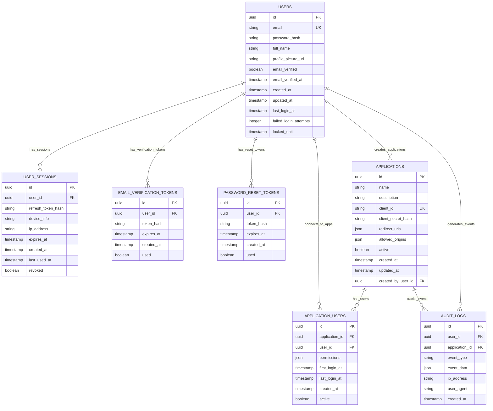

# Entity Relationships - AuthentiIDP v1.0

## Entity Relationship Diagram

## Data Ownership Map

| Entity | Owning Service | Storage | Read Access | Write Access | Lifecycle |
|--------|----------------|---------|-------------|---------------|-----------|
| **USERS** | AuthentiIDP API | PostgreSQL | API Service, Admin Dashboard | API Service Only | Created on registration, soft-deleted on account deletion |
| **APPLICATIONS** | AuthentiIDP API | PostgreSQL | API Service, Admin Dashboard, Application Owners | API Service Only | Created via Admin Dashboard, marked inactive on deletion |
| **USER_SESSIONS** | AuthentiIDP API | PostgreSQL | API Service Only | API Service Only | Created on login, expired/revoked on logout or timeout |
| **EMAIL_VERIFICATION_TOKENS** | AuthentiIDP API | PostgreSQL | API Service Only | API Service Only | Short-lived (24 hours), auto-deleted after use |
| **PASSWORD_RESET_TOKENS** | AuthentiIDP API | PostgreSQL | API Service Only | API Service Only | Short-lived (1 hour), auto-deleted after use |
| **APPLICATION_USERS** | AuthentiIDP API | PostgreSQL | API Service, Admin Dashboard | API Service Only | Created on first app access, tracks user-app relationship |
| **AUDIT_LOGS** | AuthentiIDP API | PostgreSQL | API Service, Admin Dashboard | API Service Only | Append-only, retained for compliance and monitoring |

## Entity Relationships and Dependencies

### Core Data Entities

| Relationship | Cardinality | Referential Integrity | Cascade Behavior | Business Rules |
|-------------|-------------|----------------------|------------------|----------------|
| USERS → USER_SESSIONS | 1:Many | Sessions are deleted when user account is deleted | ON DELETE CASCADE for user deletion, manual cleanup for session expiration | Maximum 10 concurrent sessions per user, oldest sessions revoked automatically |
| USERS → APPLICATIONS | 1:Many | Applications retain created_by_user_id even if creator account is deleted | ON DELETE SET NULL for creator reference | Only verified users can create applications, maximum 5 applications per user in MVP |
| APPLICATIONS → APPLICATION_USERS | 1:Many | Application-user relationships are deleted when application is deleted | ON DELETE CASCADE when application is removed | First access automatically creates relationship, tracks permissions and usage |
| USERS → APPLICATION_USERS | 1:Many | User-application relationships are deleted when user account is deleted | ON DELETE CASCADE for user deletion | Permissions default to basic profile access, can be customized per application |

### Derived Data Relationships

| Source → Target | Aggregation Type | Recalculation | Historical Data | Dependencies |
|----------------|------------------|---------------|-----------------|--------------|
| USERS → AUDIT_LOGS | Real-time | Real-time logging on authentication events, batch processing for analytics | Permanent audit trail maintained for security and compliance requirements | All user authentication and authorization events generate audit entries |
| APPLICATIONS → AUDIT_LOGS | Real-time | Real-time event logging, periodic analytics aggregation | Complete application usage history for product analytics | Application access, configuration changes, and user interactions generate logs |

### Configuration and State Relationships

| Config Entity → Target | Global Impact | Application | Dependencies |
|------------------------|---------------|-------------|--------------|
| EMAIL_VERIFICATION_TOKENS → USERS | Token validation affects user verification status and access permissions | Email verification enables full account access and application creation | User registration flow depends on successful email verification |
| PASSWORD_RESET_TOKENS → USERS | Password reset affects user authentication across all connected applications | Successful password reset invalidates all existing user sessions | Password reset requires existing user account and valid email address |

## Access Control and Boundaries

### Service Ownership Boundaries

| Service | Full Control | Read Access | Write Authority | Validation |
|---------|--------------|-------------|-----------------|------------|
| AuthentiIDP API Service | All entities - complete CRUD operations and business logic enforcement | Complete read access to all user and application data | Exclusive write permissions with full validation and security enforcement | Password strength, email format, business rules, rate limiting, security policies |
| React SDK | None - no direct database access | User profile data and application permissions through API endpoints | None - all writes go through API service with proper authentication | Client-side validation for user experience only, not security enforcement |
| Admin Dashboard | None - interface only, no direct data manipulation | Application management data, user statistics, audit logs through API | Application configuration changes through API service | UI form validation only, business rules enforced by API service |
| PostgreSQL Database | Data persistence and integrity constraints at database level | Direct read access by API service only | Write access restricted to API service with connection pooling | Database-level constraints, foreign key relationships, data type enforcement |

### Data Flow Patterns

| Pattern Type | Step | Description |
|-------------|------|-------------|
| Write Operations | 1. | Authentication - Verify user identity and permissions before any write operation |
| | 2. | Validation - Validate input data format, business rules, and security constraints |
| | 3. | Transaction - Execute write operations within database transactions for consistency |
| | 4. | Audit - Log all write operations with user context and timestamp information |
| Read Operations | 1. | Authorization - Verify user has permission to access requested data |
| | 2. | Query - Execute optimized database queries with appropriate indexes |
| | 3. | Transformation - Format data appropriately for client consumption |
| | 4. | Caching - Cache frequently accessed data to improve performance |
| Cross-Service Communication | | Token Validation - SDKs communicate with API service for token validation and refresh |
| | | Event Logging - All authentication events logged asynchronously for audit and monitoring |
| | | Error Handling - Structured error responses with appropriate HTTP status codes |
| | | Data Consistency - Strong consistency for authentication data, eventual consistency for analytics |

---

*This data ownership model ensures secure, consistent data management while maintaining clear service boundaries and supporting the MVP scale of AuthentiIDP v1.0.*