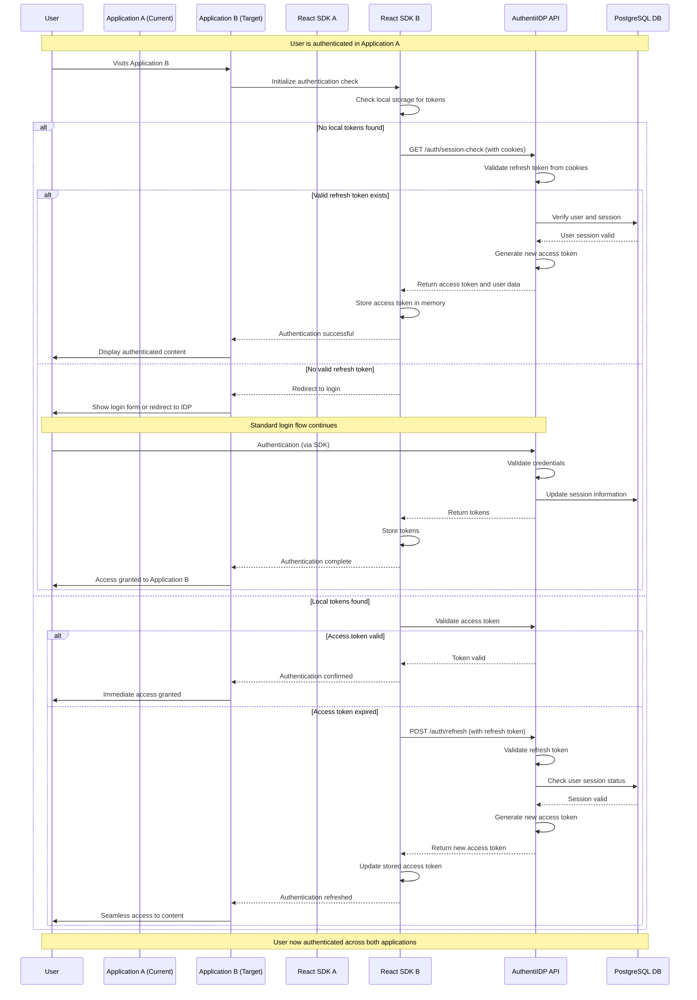

# System Flow: SSO Login Across Applications - AuthentiIDP v1.0

## Trigger
Authenticated user visits a different connected application or returns to a previously visited application after their local session has expired, triggering Single Sign-On authentication flow.

## Sequence Diagram

## Step-by-Step Timeline

### 1. Cross-Application Navigation
**Trigger**: User navigates to different connected application  
**Component**: React SDK in target application  
**Actions**:
- Initialize authentication state check
- Examine local storage for existing access/refresh tokens
- Check browser cookies for cross-domain session information

**Success Response**: Valid tokens found, user immediately authenticated  
**Failure Scenarios**: No tokens found, proceed to SSO session check

---

### 2. SSO Session Validation
**Trigger**: No local tokens found in target application  
**Component**: AuthentiIDP API Service  
**Actions**:
- Check for valid refresh token in HttpOnly cookies
- Validate refresh token against database session records
- Verify user account status and session expiration
- Generate new access token if session is valid

**Success Response**: New access token generated, user automatically logged in  
**Failure Scenarios**: No valid session, redirect to login

---

### 3. Token Refresh Flow
**Trigger**: Expired access token detected during API request  
**Component**: React SDK + AuthentiIDP API Service  
**Actions**:
- Detect 401 Unauthorized response from API request
- Automatically attempt token refresh using stored refresh token
- Validate refresh token and generate new access token
- Retry original API request with new access token

**Success Response**: Seamless token renewal, original request completed  
**Failure Scenarios**: Refresh token expired, redirect to login

---

### 4. Session Synchronization
**Trigger**: Successful authentication in new application  
**Component**: AuthentiIDP API Service  
**Actions**:
- Update session information across all connected applications
- Set consistent cookie expiration times
- Log authentication event for audit purposes
- Update last accessed timestamp for user

**Success Response**: Consistent authentication state across applications

---

### 5. Logout Propagation
**Trigger**: User logs out from any connected application  
**Component**: React SDK + AuthentiIDP API Service  
**Actions**:
- Determine logout scope (single app vs. all applications)
- Invalidate tokens in local storage and cookies
- Notify AuthentiIDP API of logout event
- Clear authentication state in SDK

**Success Response**: User logged out according to selected scope

---

## Service Roles

### React SDK (Target Application)
- **Primary**: Local token management, automatic SSO detection, transparent authentication
- **Secondary**: Error handling, user experience continuity
- **Data Flow**: Checks local tokens, requests new tokens, manages authentication state

### AuthentiIDP API Service
- **Primary**: Cross-application session management, token validation and generation
- **Secondary**: Session tracking, audit logging, security enforcement
- **Data Flow**: Validates sessions, generates tokens, maintains user authentication state

### PostgreSQL Database
- **Primary**: Session persistence, user status tracking, token validation data
- **Secondary**: Cross-application usage analytics, security audit logs
- **Data Flow**: Stores session information, validates user status, tracks login patterns

### Browser Storage & Cookies
- **Primary**: Token storage, cross-domain session information
- **Secondary**: User preference storage, application state
- **Data Flow**: Stores tokens locally, maintains cross-domain authentication cookies

## Error Scenarios

### Session Timeout
**Scenario**: User's refresh token expires while using multiple applications  
**Response**:
- Detect expired refresh token during automatic renewal attempt
- Clear all local authentication state across applications
- Redirect user to login with clear session timeout message
- Preserve user context for post-authentication redirect

**Recovery**: Clear communication about session expiration with easy re-authentication

---

### Cross-Domain Cookie Limitations
**Scenario**: Browser restrictions prevent cross-domain session sharing  
**Response**:
- Fall back to explicit token validation requests
- Implement alternative session detection mechanisms
- Provide clear user guidance about browser requirements
- Maintain graceful degradation to standard login flow

**Recovery**: Alternative authentication methods with user education

---

### Network Connectivity Issues
**Scenario**: Token refresh fails due to network problems  
**Response**:
- Implement retry logic with exponential backoff
- Cache authentication state for offline resilience
- Provide user feedback about connectivity status
- Queue authentication attempts for when connection resumes

**Recovery**: Robust retry mechanisms with user communication

---

### Partial Authentication State
**Scenario**: User authenticated in some applications but not others  
**Response**:
- Detect inconsistent authentication state across applications
- Attempt automatic session synchronization
- Provide user control over authentication scope
- Log inconsistencies for system monitoring

**Recovery**: Automatic state synchronization with user override options

---

*This SSO flow ensures seamless user experience across multiple connected applications while maintaining security and providing fallback mechanisms for various failure scenarios.*