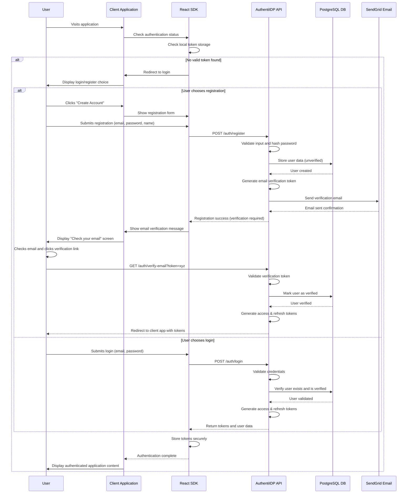

# System Flow: User Registration & Authentication - AuthentiIDP v1.0

## Trigger
User visits a connected application for the first time and needs to create an account, or returning user attempts to access a connected application requiring authentication.

## Sequence Diagram

## Step-by-Step Timeline

### 1. Authentication Status Check
**Trigger**: User visits client application  
**Component**: React SDK  
**Actions**:
- Check local storage for valid access token
- Attempt automatic token refresh if access token expired
- Determine if user needs to authenticate

**Success Response**: Valid token found, user proceeds to application  
**Failure Scenarios**: No token or invalid token, redirect to authentication

---

### 2. User Registration Process
**Trigger**: User clicks "Create Account" option  
**Component**: React SDK + AuthentiIDP API Service  
**Actions**:
- Display registration form with email, password, and name fields
- Validate input on client-side (real-time feedback)
- Submit registration data to API service
- Hash password using bcrypt with appropriate salt rounds
- Store user data in database with unverified status

**Success Response**: Registration successful, verification email sent  
**Failure Scenarios**: Email already exists, password too weak, validation errors

---

### 3. Email Verification
**Trigger**: User clicks verification link in email  
**Component**: AuthentiIDP API Service  
**Actions**:
- Validate verification token against database record
- Mark user account as verified
- Generate authentication tokens for verified user
- Redirect user back to originating client application

**Success Response**: Account verified, user automatically logged in  
**Failure Scenarios**: Expired token, invalid token, already verified account

---

### 4. Login Authentication
**Trigger**: User submits login credentials  
**Component**: AuthentiIDP API Service  
**Actions**:
- Validate email format and password presence
- Look up user in database by email
- Compare provided password with stored hash
- Generate JWT access token (15-minute expiration)
- Generate refresh token (30-day expiration, HttpOnly cookie)

**Success Response**: Tokens generated and returned to client  
**Failure Scenarios**: Invalid credentials, unverified account, account locked

---

### 5. Token Management and Storage
**Trigger**: Successful authentication  
**Component**: React SDK  
**Actions**:
- Store access token in memory for immediate use
- Store refresh token in secure HttpOnly cookie
- Set up automatic token refresh before expiration
- Update application authentication state

**Success Response**: User authenticated and ready to use application

---

## Service Roles

### React SDK
- **Primary**: Client-side authentication flow orchestration, token storage, UI component rendering
- **Secondary**: Input validation, error handling, automatic token refresh
- **Data Flow**: Receives user input, sends to API service, manages returned tokens

### AuthentiIDP API Service
- **Primary**: User registration, credential validation, token generation, email verification
- **Secondary**: Security enforcement, rate limiting, audit logging
- **Data Flow**: Processes authentication requests, queries database, generates security tokens

### PostgreSQL Database
- **Primary**: User data persistence, account status tracking, token validation data
- **Secondary**: Audit logging, session management
- **Data Flow**: Stores user credentials and profile data, tracks verification status

### SendGrid Email Service
- **Primary**: Email verification delivery, password reset notifications
- **Secondary**: Account security notifications
- **Data Flow**: Receives email requests from API service, delivers to user email addresses

## Error Scenarios

### Invalid Registration Data
**Scenario**: User submits registration with existing email or weak password  
**Response**:
- API service validates input and returns structured error response
- React SDK displays specific validation errors inline
- User corrected data and resubmits without losing previous input

**Recovery**: Clear error messaging with specific improvement suggestions

---

### Email Verification Failure
**Scenario**: Email delivery fails or verification token expires  
**Response**:
- API service tracks email delivery status and token expiration
- Provide "Resend verification email" option in user interface
- Generate new verification token and send fresh email

**Recovery**: Multiple retry attempts with escalating support options

---

### Authentication Token Expiry
**Scenario**: Access token expires during user session  
**Response**:
- React SDK detects expired token during API request
- Automatically attempt token refresh using stored refresh token
- If refresh succeeds, retry original request transparently
- If refresh fails, redirect to login with context preservation

**Recovery**: Seamless token refresh or contextual re-authentication

---

*This flow ensures secure user onboarding and authentication while providing smooth user experience through automated token management and comprehensive error recovery.*