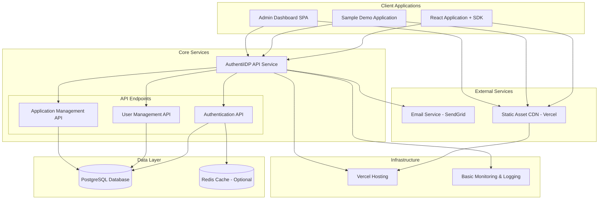

# System Architecture Overview - AuthentiIDP v1.0

## Purpose
Define AuthentiIDP v1.0 system architecture: a cost-optimized centralized identity provider service for personal applications with seamless SSO integration and developer-friendly SDK.

## Design Goals
- **Simplicity**: MVP-focused architecture avoiding over-engineering for initial 50-user scale
- **Cost Efficiency**: Zero-cost MVP using free tiers for database, hosting, and email services
- **Security**: Industry-standard authentication with JWT tokens, secure session management
- **Developer Experience**: Easy integration with React/NodeJS SDKs and pre-built components
- **Extensibility**: Architecture supports growth beyond MVP without major refactoring
- **Reliability**: Single point of failure acceptable for MVP with clear upgrade path

## Design Decisions and Justifications

| Decision | Rationale | Implementation |
|----------|-----------|----------------|
| Monolithic API Architecture | Simplified deployment and reduced operational complexity for MVP | Single IDP API service handling auth, user management, and application management |
| JWT + Refresh Token Strategy | Balance security with user experience (30-day sessions) | Access tokens (15min) + HttpOnly refresh tokens (30 days) with rotation |
| Free Tier Infrastructure | Zero-cost MVP requirement with clear upgrade path | PostgreSQL (Supabase free), Vercel hosting, SendGrid free email |
| React + NodeJS Focus | Target audience primarily uses JavaScript stack | Dedicated SDKs for React frontend and NodeJS backend integration |
| Direct Client Integration | Simplified architecture over complex OAuth2 flows for personal apps | SDK handles token management, storage, and refresh automatically |
| Admin Dashboard SPA | Cost-effective management interface | Single-page application for application and user management |

## Architecture Diagram

AuthentiIDP uses simplified monolithic architecture optimized for MVP development and cost efficiency. The single API service handles all authentication, user management, and application management functions through focused API endpoints. Client applications integrate via React and NodeJS SDKs that abstract token management and provide pre-built UI components. PostgreSQL provides reliable data persistence while Redis caching remains optional for MVP. Email verification and password reset use SendGrid's free tier. Infrastructure leverages Vercel's free hosting tier with automatic scaling. The architecture prioritizes developer experience through comprehensive SDKs while maintaining clear separation of concerns for future service decomposition.