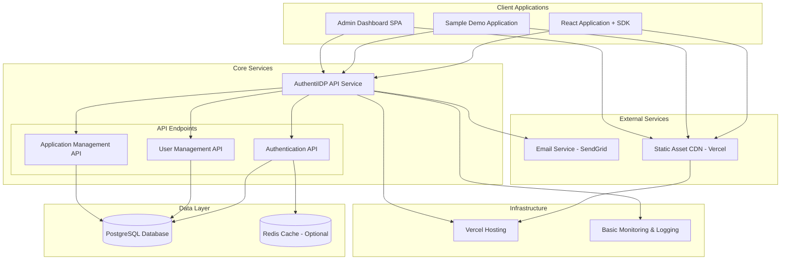

# System Architecture Overview - AuthentiIDP v1.0

## Purpose
Define AuthentiIDP v1.0 system architecture: a cost-optimized centralized identity provider service for personal applications with seamless SSO integration and developer-friendly SDK.

## Design Goals
- **Simplicity**: MVP-focused architecture avoiding over-engineering for initial 50-user scale
- **Cost Efficiency**: Zero-cost MVP using free tiers for database, hosting, and email services
- **Security**: Industry-standard authentication with JWT tokens, secure session management
- **Developer Experience**: Easy integration with React/NodeJS SDKs and pre-built components
- **Extensibility**: Architecture supports growth beyond MVP without major refactoring
- **Reliability**: Single point of failure acceptable for MVP with clear upgrade path

## Design Decisions and Justifications

| Decision | Rationale | Implementation |
|----------|-----------|----------------|
| Monolithic API Architecture | Simplified deployment and reduced operational complexity for MVP | Single IDP API service handling auth, user management, and application management |
| JWT + Refresh Token Strategy | Balance security with user experience (30-day sessions) | Access tokens (15min) + HttpOnly refresh tokens (30 days) with rotation |
| Free Tier Infrastructure | Zero-cost MVP requirement with clear upgrade path | PostgreSQL (Supabase free), Vercel hosting, SendGrid free email |
| React + NodeJS Focus | Target audience primarily uses JavaScript stack | Dedicated SDKs for React frontend and NodeJS backend integration |
| Direct Client Integration | Simplified architecture over complex OAuth2 flows for personal apps | SDK handles token management, storage, and refresh automatically |
| Admin Dashboard SPA | Cost-effective management interface | Single-page application for application and user management |

## Architecture Diagram

## Component Communication

| Component | Responsibility | Inbound Communications | Outbound Communications |
|-----------|---------------|----------------------|------------------------|
| React Application + SDK | Client-side user interface for application registration, user management, and authentication flows. Provides pre-built components and handles token management automatically. | • User interactions (Browser) | • AuthentiIDP API Service (HTTPS) • Static Asset CDN (HTTPS) |
| Sample Demo Application | Reference implementation demonstrating SDK integration patterns and authentication flows. Serves as testing platform and developer documentation. | • User interactions (Browser) | • AuthentiIDP API Service (HTTPS) • Static Asset CDN (HTTPS) |
| Admin Dashboard SPA | Administrative interface for managing applications, users, and system configuration. Provides analytics and API key management capabilities. | • User interactions (Browser) | • AuthentiIDP API Service (HTTPS) • Static Asset CDN (HTTPS) |
| AuthentiIDP API Service | Core identity provider handling authentication, user management, and application registration. Manages JWT tokens, sessions, and cross-application SSO coordination. | • React SDK (HTTPS) • NodeJS SDK (HTTPS) • Admin Dashboard (HTTPS) • Sample App (HTTPS) | • PostgreSQL Database (TCP) • Redis Cache (TCP) • Email Service (HTTPS) • Monitoring (HTTP) |
| Authentication API | User authentication, password validation, JWT token generation and refresh. Handles login, logout, and session management functionality. | • AuthentiIDP API Service (HTTP) | • PostgreSQL Database (TCP) • Redis Cache (TCP) |
| User Management API | User registration, profile management, email verification, password reset. Manages user data and account lifecycle operations. | • AuthentiIDP API Service (HTTP) | • PostgreSQL Database (TCP) • Email Service (HTTPS) |
| Application Management API | Application registration, API key generation, configuration management. Handles client application onboarding and management. | • AuthentiIDP API Service (HTTP) | • PostgreSQL Database (TCP) |
| PostgreSQL Database | Primary data persistence for users, applications, sessions, and configuration. Maintains ACID compliance and data integrity for all system data. | • Authentication API (TCP) • User Management API (TCP) • Application Management API (TCP) | • None |
| Redis Cache (Optional) | Session caching, token blacklisting, and performance optimization. Improves response times for authentication and session validation. | • Authentication API (TCP) | • None |
| Email Service (SendGrid) | Email verification, password reset notifications, and system communications. Handles transactional email delivery using free tier. | • User Management API (HTTPS) | • None |
| Static Asset CDN (Vercel) | Content delivery for client applications, SDKs, and static assets. Provides global distribution and caching for web assets. | • React Application (HTTPS) • Sample App (HTTPS) • Admin Dashboard (HTTPS) | • None |
| Basic Monitoring & Logging | System observability, performance tracking, and error monitoring. Collects metrics and logs for system health and security analysis. | • AuthentiIDP API Service (HTTP) | • None |